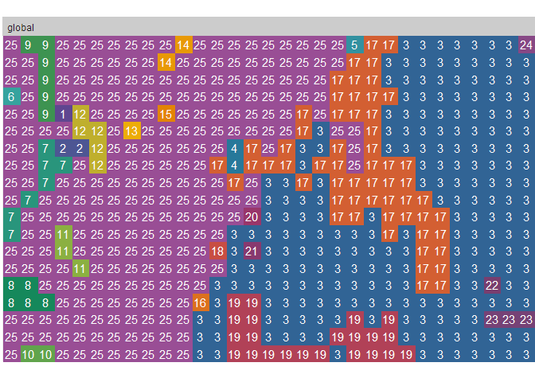

Landscapemetrics Exercise
================

## Landscape metrics calculation exercise using the [Landscapemetrics](https://github.com/r-spatialecology/landscapemetrics) library

### Download raster data:

[Enhanced Vegetation
Index](https://en.wikipedia.org/wiki/Enhanced_vegetation_index)
downloaded from [Nasa
Giovanni](https://giovanni.gsfc.nasa.gov/giovanni/giovanni-login-redirect?code=9778b03b2b4906b69a84134c82d0d2eba9f2ffef0c5f94ce46a0ba002e5a30ed&state=https%3A%2F%2Fgiovanni%2Egsfc%2Enasa%2Egov%2Fgiovanni%2F)

``` r
raster<-raster("./raster/GIOVANNI-g4.timeAvgMap.MYD13C2_006_CMG_0_05_Deg_Monthly_EVI.20200101-20200531.74W_6N_72W_7N.tif")

check_landscape(raster) %>% 
  kable(caption="EVI features") %>% 
  kable_styling(bootstrap_options = c("striped", "hover", "condensed"),
                fixed_thead = T,
                full_width = F, 
                position = "left")
```

<table class="table table-striped table-hover table-condensed" style="width: auto !important; ">

<caption>

EVI features

</caption>

<thead>

<tr>

<th style="text-align:right;position: sticky; top:0; background-color: #FFFFFF;">

layer

</th>

<th style="text-align:left;position: sticky; top:0; background-color: #FFFFFF;">

crs

</th>

<th style="text-align:left;position: sticky; top:0; background-color: #FFFFFF;">

units

</th>

<th style="text-align:left;position: sticky; top:0; background-color: #FFFFFF;">

class

</th>

<th style="text-align:right;position: sticky; top:0; background-color: #FFFFFF;">

n\_classes

</th>

<th style="text-align:left;position: sticky; top:0; background-color: #FFFFFF;">

OK

</th>

</tr>

</thead>

<tbody>

<tr>

<td style="text-align:right;">

1

</td>

<td style="text-align:left;">

geographic

</td>

<td style="text-align:left;">

degrees

</td>

<td style="text-align:left;">

non-integer

</td>

<td style="text-align:right;">

578

</td>

<td style="text-align:left;">

x

</td>

</tr>

</tbody>

</table>

The raster has a geographic CRS, is necesary to transform to projected
CRS using
[epsg:3117](https://spatialreference.org/ref/epsg/magna-sirgas-colombia-bogota-zone/)

``` r
crs(raster)<- "+init=epsg:3117 +proj=longlat +datum=WGS84 +no_defs"

check_landscape(raster) %>% kable()
```

<table>

<thead>

<tr>

<th style="text-align:right;">

layer

</th>

<th style="text-align:left;">

crs

</th>

<th style="text-align:left;">

units

</th>

<th style="text-align:left;">

class

</th>

<th style="text-align:right;">

n\_classes

</th>

<th style="text-align:left;">

OK

</th>

</tr>

</thead>

<tbody>

<tr>

<td style="text-align:right;">

1

</td>

<td style="text-align:left;">

projected

</td>

<td style="text-align:left;">

m

</td>

<td style="text-align:left;">

non-integer

</td>

<td style="text-align:right;">

578

</td>

<td style="text-align:left;">

x

</td>

</tr>

</tbody>

</table>

#### Summary of raster data

    ##         GIOVANNI.g4.timeAvgMap.MYD13C2_006_CMG_0_05_Deg_Monthly_EVI.20200101.20200531.74W_6N_72W_7N
    ## Min.                                                                                        0.18222
    ## 1st Qu.                                                                                     0.35004
    ## Median                                                                                      0.45538
    ## 3rd Qu.                                                                                     0.53242
    ## Max.                                                                                        0.61878
    ## NA's                                                                                        0.00000

#### Raster histogram

``` r
ggplot(dat, aes(x = breaks, y = counts, fill =counts)) + ## Note the new aes fill here
  geom_bar(stat = "identity",alpha = 1)+
  labs(x="Pixel value",y="Frequency",
       title = "Raster histogram",
       caption = "EVI from Nasa Giovanny:\nGIOVANNI-g4.timeAvgMap.MYD13C2_006_CMG_0_05_Deg_Monthly_EVI.20200101-20200531.74W_6N_72W_7N")+
  scale_x_continuous(breaks = seq(-0.1,1,0.1),
                   labels = seq(-0.1,1,0.1))+
  scale_fill_gradient(low="grey80", high="white")+          ## to play with colors limits
  theme_light()+
  theme(plot.title=element_text(size=19),
        plot.caption = element_text(size = 7, color="grey60"),
        panel.background = element_rect(fill="steelblue"),
        panel.grid.major = element_line(size = 0.3, linetype = 'dotted',
                                colour = "white"),
        panel.grid.minor = element_line(size = 0.3, linetype = 'dotted',
                                colour = "white"),
        legend.position = "none")
```

<!-- -->

### Raster reclasification

#### clasification matrix

This is where the different classes and the cutoff points of each one
are defined. In this example we are going to reclassify the raster into
tree classes.

``` r
# create classification matrix
reclass_df <- c(0.181, 0.3, 1,
              0.3, 0.4, 1,
             0.4, 0.5, 2,
             0.5, Inf, 3)
reclass_df
```

    ##  [1] 0.181 0.300 1.000 0.300 0.400 1.000 0.400 0.500 2.000 0.500   Inf 3.000

``` r
# reshape the object into a matrix with columns and rows
reclass_m <- matrix(reclass_df,
                ncol = 3,
                byrow = TRUE)
reclass_m
```

    ##       [,1] [,2] [,3]
    ## [1,] 0.181  0.3    1
    ## [2,] 0.300  0.4    1
    ## [3,] 0.400  0.5    2
    ## [4,] 0.500  Inf    3

And here is where the reclassification process is made

``` r
# reclassify the raster using the reclass object - reclass_m
raster_classified <- reclassify(raster,reclass_m)
```

### Reclassification result

``` r
ggplot(dat2, aes(x = breaks, y = counts, fill =counts)) + ## Note the new aes fill here
  geom_bar(stat = "identity",alpha = 1)+
  labs(x="Class",y="",
       title = "Number of pixels in each class",
       caption = "EVI from Nasa Giovanny:\nGIOVANNI-g4.timeAvgMap.MYD13C2_006_CMG_0_05_Deg_Monthly_EVI.20200101-20200531.74W_6N_72W_7N")+
  scale_x_continuous(breaks = seq(1,3,1),
                   labels = seq(1,3,1))+
  scale_fill_gradient(low="white", high="white")+          ## to play with colors limits
  theme_light()+
  theme(plot.title=element_text(size=19),
        plot.caption = element_text(size = 7, color="grey60"),
        panel.background = element_rect(fill="steelblue"),
        panel.grid.major = element_line(size = 0.3, linetype = 'dotted',
                                colour = "white"),
        panel.grid.minor = element_line(size = 0.3, linetype = 'dotted',
                                colour = "white"),
        legend.position = "none")
```

<!-- -->

### Plot the reclassified raster

``` r
# plot reclassified data
show_landscape(raster_classified)
```

<!-- -->

``` r
check_landscape(raster_classified)
```

    ##   layer       crs units   class n_classes OK
    ## 1     1 projected     m integer         3  v

Here we see the tree different patch

### landscape metrics

  - Table of metrics by each patch

<!-- end list -->

``` r
list_lsm(level = 'patch') 
```

    ## # A tibble: 12 x 5
    ##    metric name                            type               level function_name
    ##    <chr>  <chr>                           <chr>              <chr> <chr>        
    ##  1 area   patch area                      area and edge met~ patch lsm_p_area   
    ##  2 cai    core area index                 core area metric   patch lsm_p_cai    
    ##  3 circle related circumscribing circle   shape metric       patch lsm_p_circle 
    ##  4 contig contiguity index                shape metric       patch lsm_p_contig 
    ##  5 core   core area                       core area metric   patch lsm_p_core   
    ##  6 enn    euclidean nearest neighbor dis~ aggregation metric patch lsm_p_enn    
    ##  7 frac   fractal dimension index         shape metric       patch lsm_p_frac   
    ##  8 gyrate radius of gyration              area and edge met~ patch lsm_p_gyrate 
    ##  9 ncore  number of core areas            core area metric   patch lsm_p_ncore  
    ## 10 para   perimeter-area ratio            shape metric       patch lsm_p_para   
    ## 11 perim  patch perimeter                 area and edge met~ patch lsm_p_perim  
    ## 12 shape  shape index                     shape metric       patch lsm_p_shape

``` r
metrics<- calculate_lsm(raster_classified, level = "patch") 

kable(metrics, caption = "Landscape Metrics by patch") %>% 
  kable_styling(bootstrap_options = c("striped", "hover", "condensed"),
                fixed_thead = T,
                full_width = F, 
                position = "left") %>% 
  scroll_box(width = "400px", height = "400px")
```

<div style="border: 1px solid #ddd; padding: 0px; overflow-y: scroll; height:400px; overflow-x: scroll; width:400px; ">

<table class="table table-striped table-hover table-condensed" style="width: auto !important; ">

<caption>

Landscape Metrics by patch

</caption>

<thead>

<tr>

<th style="text-align:right;position: sticky; top:0; background-color: #FFFFFF;position: sticky; top:0; background-color: #FFFFFF;">

layer

</th>

<th style="text-align:left;position: sticky; top:0; background-color: #FFFFFF;position: sticky; top:0; background-color: #FFFFFF;">

level

</th>

<th style="text-align:right;position: sticky; top:0; background-color: #FFFFFF;position: sticky; top:0; background-color: #FFFFFF;">

class

</th>

<th style="text-align:right;position: sticky; top:0; background-color: #FFFFFF;position: sticky; top:0; background-color: #FFFFFF;">

id

</th>

<th style="text-align:left;position: sticky; top:0; background-color: #FFFFFF;position: sticky; top:0; background-color: #FFFFFF;">

metric

</th>

<th style="text-align:right;position: sticky; top:0; background-color: #FFFFFF;position: sticky; top:0; background-color: #FFFFFF;">

value

</th>

</tr>

</thead>

<tbody>

<tr>

<td style="text-align:right;">

1

</td>

<td style="text-align:left;">

patch

</td>

<td style="text-align:right;">

1

</td>

<td style="text-align:right;">

1

</td>

<td style="text-align:left;">

area

</td>

<td style="text-align:right;">

0.0000002

</td>

</tr>

<tr>

<td style="text-align:right;">

1

</td>

<td style="text-align:left;">

patch

</td>

<td style="text-align:right;">

1

</td>

<td style="text-align:right;">

2

</td>

<td style="text-align:left;">

area

</td>

<td style="text-align:right;">

0.0000005

</td>

</tr>

<tr>

<td style="text-align:right;">

1

</td>

<td style="text-align:left;">

patch

</td>

<td style="text-align:right;">

1

</td>

<td style="text-align:right;">

3

</td>

<td style="text-align:left;">

area

</td>

<td style="text-align:right;">

0.0000542

</td>

</tr>

<tr>

<td style="text-align:right;">

1

</td>

<td style="text-align:left;">

patch

</td>

<td style="text-align:right;">

1

</td>

<td style="text-align:right;">

4

</td>

<td style="text-align:left;">

area

</td>

<td style="text-align:right;">

0.0000005

</td>

</tr>

<tr>

<td style="text-align:right;">

1

</td>

<td style="text-align:left;">

patch

</td>

<td style="text-align:right;">

1

</td>

<td style="text-align:right;">

5

</td>

<td style="text-align:left;">

area

</td>

<td style="text-align:right;">

0.0000002

</td>

</tr>

<tr>

<td style="text-align:right;">

1

</td>

<td style="text-align:left;">

patch

</td>

<td style="text-align:right;">

2

</td>

<td style="text-align:right;">

6

</td>

<td style="text-align:left;">

area

</td>

<td style="text-align:right;">

0.0000002

</td>

</tr>

<tr>

<td style="text-align:right;">

1

</td>

<td style="text-align:left;">

patch

</td>

<td style="text-align:right;">

2

</td>

<td style="text-align:right;">

7

</td>

<td style="text-align:left;">

area

</td>

<td style="text-align:right;">

0.0000017

</td>

</tr>

<tr>

<td style="text-align:right;">

1

</td>

<td style="text-align:left;">

patch

</td>

<td style="text-align:right;">

2

</td>

<td style="text-align:right;">

8

</td>

<td style="text-align:left;">

area

</td>

<td style="text-align:right;">

0.0000012

</td>

</tr>

<tr>

<td style="text-align:right;">

1

</td>

<td style="text-align:left;">

patch

</td>

<td style="text-align:right;">

2

</td>

<td style="text-align:right;">

9

</td>

<td style="text-align:left;">

area

</td>

<td style="text-align:right;">

0.0000015

</td>

</tr>

<tr>

<td style="text-align:right;">

1

</td>

<td style="text-align:left;">

patch

</td>

<td style="text-align:right;">

2

</td>

<td style="text-align:right;">

10

</td>

<td style="text-align:left;">

area

</td>

<td style="text-align:right;">

0.0000005

</td>

</tr>

<tr>

<td style="text-align:right;">

1

</td>

<td style="text-align:left;">

patch

</td>

<td style="text-align:right;">

2

</td>

<td style="text-align:right;">

11

</td>

<td style="text-align:left;">

area

</td>

<td style="text-align:right;">

0.0000007

</td>

</tr>

<tr>

<td style="text-align:right;">

1

</td>

<td style="text-align:left;">

patch

</td>

<td style="text-align:right;">

2

</td>

<td style="text-align:right;">

12

</td>

<td style="text-align:left;">

area

</td>

<td style="text-align:right;">

0.0000012

</td>

</tr>

<tr>

<td style="text-align:right;">

1

</td>

<td style="text-align:left;">

patch

</td>

<td style="text-align:right;">

2

</td>

<td style="text-align:right;">

13

</td>

<td style="text-align:left;">

area

</td>

<td style="text-align:right;">

0.0000002

</td>

</tr>

<tr>

<td style="text-align:right;">

1

</td>

<td style="text-align:left;">

patch

</td>

<td style="text-align:right;">

2

</td>

<td style="text-align:right;">

14

</td>

<td style="text-align:left;">

area

</td>

<td style="text-align:right;">

0.0000005

</td>

</tr>

<tr>

<td style="text-align:right;">

1

</td>

<td style="text-align:left;">

patch

</td>

<td style="text-align:right;">

2

</td>

<td style="text-align:right;">

15

</td>

<td style="text-align:left;">

area

</td>

<td style="text-align:right;">

0.0000002

</td>

</tr>

<tr>

<td style="text-align:right;">

1

</td>

<td style="text-align:left;">

patch

</td>

<td style="text-align:right;">

2

</td>

<td style="text-align:right;">

16

</td>

<td style="text-align:left;">

area

</td>

<td style="text-align:right;">

0.0000002

</td>

</tr>

<tr>

<td style="text-align:right;">

1

</td>

<td style="text-align:left;">

patch

</td>

<td style="text-align:right;">

2

</td>

<td style="text-align:right;">

17

</td>

<td style="text-align:left;">

area

</td>

<td style="text-align:right;">

0.0000145

</td>

</tr>

<tr>

<td style="text-align:right;">

1

</td>

<td style="text-align:left;">

patch

</td>

<td style="text-align:right;">

2

</td>

<td style="text-align:right;">

18

</td>

<td style="text-align:left;">

area

</td>

<td style="text-align:right;">

0.0000002

</td>

</tr>

<tr>

<td style="text-align:right;">

1

</td>

<td style="text-align:left;">

patch

</td>

<td style="text-align:right;">

2

</td>

<td style="text-align:right;">

19

</td>

<td style="text-align:left;">

area

</td>

<td style="text-align:right;">

0.0000055

</td>

</tr>

<tr>

<td style="text-align:right;">

1

</td>

<td style="text-align:left;">

patch

</td>

<td style="text-align:right;">

2

</td>

<td style="text-align:right;">

20

</td>

<td style="text-align:left;">

area

</td>

<td style="text-align:right;">

0.0000002

</td>

</tr>

<tr>

<td style="text-align:right;">

1

</td>

<td style="text-align:left;">

patch

</td>

<td style="text-align:right;">

2

</td>

<td style="text-align:right;">

21

</td>

<td style="text-align:left;">

area

</td>

<td style="text-align:right;">

0.0000002

</td>

</tr>

<tr>

<td style="text-align:right;">

1

</td>

<td style="text-align:left;">

patch

</td>

<td style="text-align:right;">

2

</td>

<td style="text-align:right;">

22

</td>

<td style="text-align:left;">

area

</td>

<td style="text-align:right;">

0.0000002

</td>

</tr>

<tr>

<td style="text-align:right;">

1

</td>

<td style="text-align:left;">

patch

</td>

<td style="text-align:right;">

2

</td>

<td style="text-align:right;">

23

</td>

<td style="text-align:left;">

area

</td>

<td style="text-align:right;">

0.0000007

</td>

</tr>

<tr>

<td style="text-align:right;">

1

</td>

<td style="text-align:left;">

patch

</td>

<td style="text-align:right;">

2

</td>

<td style="text-align:right;">

24

</td>

<td style="text-align:left;">

area

</td>

<td style="text-align:right;">

0.0000002

</td>

</tr>

<tr>

<td style="text-align:right;">

1

</td>

<td style="text-align:left;">

patch

</td>

<td style="text-align:right;">

3

</td>

<td style="text-align:right;">

25

</td>

<td style="text-align:left;">

area

</td>

<td style="text-align:right;">

0.0000610

</td>

</tr>

<tr>

<td style="text-align:right;">

1

</td>

<td style="text-align:left;">

patch

</td>

<td style="text-align:right;">

1

</td>

<td style="text-align:right;">

1

</td>

<td style="text-align:left;">

cai

</td>

<td style="text-align:right;">

0.0000000

</td>

</tr>

<tr>

<td style="text-align:right;">

1

</td>

<td style="text-align:left;">

patch

</td>

<td style="text-align:right;">

1

</td>

<td style="text-align:right;">

2

</td>

<td style="text-align:left;">

cai

</td>

<td style="text-align:right;">

0.0000000

</td>

</tr>

<tr>

<td style="text-align:right;">

1

</td>

<td style="text-align:left;">

patch

</td>

<td style="text-align:right;">

1

</td>

<td style="text-align:right;">

3

</td>

<td style="text-align:left;">

cai

</td>

<td style="text-align:right;">

51.6129032

</td>

</tr>

<tr>

<td style="text-align:right;">

1

</td>

<td style="text-align:left;">

patch

</td>

<td style="text-align:right;">

1

</td>

<td style="text-align:right;">

4

</td>

<td style="text-align:left;">

cai

</td>

<td style="text-align:right;">

0.0000000

</td>

</tr>

<tr>

<td style="text-align:right;">

1

</td>

<td style="text-align:left;">

patch

</td>

<td style="text-align:right;">

1

</td>

<td style="text-align:right;">

5

</td>

<td style="text-align:left;">

cai

</td>

<td style="text-align:right;">

0.0000000

</td>

</tr>

<tr>

<td style="text-align:right;">

1

</td>

<td style="text-align:left;">

patch

</td>

<td style="text-align:right;">

2

</td>

<td style="text-align:right;">

6

</td>

<td style="text-align:left;">

cai

</td>

<td style="text-align:right;">

0.0000000

</td>

</tr>

<tr>

<td style="text-align:right;">

1

</td>

<td style="text-align:left;">

patch

</td>

<td style="text-align:right;">

2

</td>

<td style="text-align:right;">

7

</td>

<td style="text-align:left;">

cai

</td>

<td style="text-align:right;">

0.0000000

</td>

</tr>

<tr>

<td style="text-align:right;">

1

</td>

<td style="text-align:left;">

patch

</td>

<td style="text-align:right;">

2

</td>

<td style="text-align:right;">

8

</td>

<td style="text-align:left;">

cai

</td>

<td style="text-align:right;">

0.0000000

</td>

</tr>

<tr>

<td style="text-align:right;">

1

</td>

<td style="text-align:left;">

patch

</td>

<td style="text-align:right;">

2

</td>

<td style="text-align:right;">

9

</td>

<td style="text-align:left;">

cai

</td>

<td style="text-align:right;">

0.0000000

</td>

</tr>

<tr>

<td style="text-align:right;">

1

</td>

<td style="text-align:left;">

patch

</td>

<td style="text-align:right;">

2

</td>

<td style="text-align:right;">

10

</td>

<td style="text-align:left;">

cai

</td>

<td style="text-align:right;">

0.0000000

</td>

</tr>

<tr>

<td style="text-align:right;">

1

</td>

<td style="text-align:left;">

patch

</td>

<td style="text-align:right;">

2

</td>

<td style="text-align:right;">

11

</td>

<td style="text-align:left;">

cai

</td>

<td style="text-align:right;">

0.0000000

</td>

</tr>

<tr>

<td style="text-align:right;">

1

</td>

<td style="text-align:left;">

patch

</td>

<td style="text-align:right;">

2

</td>

<td style="text-align:right;">

12

</td>

<td style="text-align:left;">

cai

</td>

<td style="text-align:right;">

0.0000000

</td>

</tr>

<tr>

<td style="text-align:right;">

1

</td>

<td style="text-align:left;">

patch

</td>

<td style="text-align:right;">

2

</td>

<td style="text-align:right;">

13

</td>

<td style="text-align:left;">

cai

</td>

<td style="text-align:right;">

0.0000000

</td>

</tr>

<tr>

<td style="text-align:right;">

1

</td>

<td style="text-align:left;">

patch

</td>

<td style="text-align:right;">

2

</td>

<td style="text-align:right;">

14

</td>

<td style="text-align:left;">

cai

</td>

<td style="text-align:right;">

0.0000000

</td>

</tr>

<tr>

<td style="text-align:right;">

1

</td>

<td style="text-align:left;">

patch

</td>

<td style="text-align:right;">

2

</td>

<td style="text-align:right;">

15

</td>

<td style="text-align:left;">

cai

</td>

<td style="text-align:right;">

0.0000000

</td>

</tr>

<tr>

<td style="text-align:right;">

1

</td>

<td style="text-align:left;">

patch

</td>

<td style="text-align:right;">

2

</td>

<td style="text-align:right;">

16

</td>

<td style="text-align:left;">

cai

</td>

<td style="text-align:right;">

0.0000000

</td>

</tr>

<tr>

<td style="text-align:right;">

1

</td>

<td style="text-align:left;">

patch

</td>

<td style="text-align:right;">

2

</td>

<td style="text-align:right;">

17

</td>

<td style="text-align:left;">

cai

</td>

<td style="text-align:right;">

15.5172414

</td>

</tr>

<tr>

<td style="text-align:right;">

1

</td>

<td style="text-align:left;">

patch

</td>

<td style="text-align:right;">

2

</td>

<td style="text-align:right;">

18

</td>

<td style="text-align:left;">

cai

</td>

<td style="text-align:right;">

0.0000000

</td>

</tr>

<tr>

<td style="text-align:right;">

1

</td>

<td style="text-align:left;">

patch

</td>

<td style="text-align:right;">

2

</td>

<td style="text-align:right;">

19

</td>

<td style="text-align:left;">

cai

</td>

<td style="text-align:right;">

4.5454545

</td>

</tr>

<tr>

<td style="text-align:right;">

1

</td>

<td style="text-align:left;">

patch

</td>

<td style="text-align:right;">

2

</td>

<td style="text-align:right;">

20

</td>

<td style="text-align:left;">

cai

</td>

<td style="text-align:right;">

0.0000000

</td>

</tr>

<tr>

<td style="text-align:right;">

1

</td>

<td style="text-align:left;">

patch

</td>

<td style="text-align:right;">

2

</td>

<td style="text-align:right;">

21

</td>

<td style="text-align:left;">

cai

</td>

<td style="text-align:right;">

0.0000000

</td>

</tr>

<tr>

<td style="text-align:right;">

1

</td>

<td style="text-align:left;">

patch

</td>

<td style="text-align:right;">

2

</td>

<td style="text-align:right;">

22

</td>

<td style="text-align:left;">

cai

</td>

<td style="text-align:right;">

0.0000000

</td>

</tr>

<tr>

<td style="text-align:right;">

1

</td>

<td style="text-align:left;">

patch

</td>

<td style="text-align:right;">

2

</td>

<td style="text-align:right;">

23

</td>

<td style="text-align:left;">

cai

</td>

<td style="text-align:right;">

0.0000000

</td>

</tr>

<tr>

<td style="text-align:right;">

1

</td>

<td style="text-align:left;">

patch

</td>

<td style="text-align:right;">

2

</td>

<td style="text-align:right;">

24

</td>

<td style="text-align:left;">

cai

</td>

<td style="text-align:right;">

0.0000000

</td>

</tr>

<tr>

<td style="text-align:right;">

1

</td>

<td style="text-align:left;">

patch

</td>

<td style="text-align:right;">

3

</td>

<td style="text-align:right;">

25

</td>

<td style="text-align:left;">

cai

</td>

<td style="text-align:right;">

53.2786885

</td>

</tr>

<tr>

<td style="text-align:right;">

1

</td>

<td style="text-align:left;">

patch

</td>

<td style="text-align:right;">

1

</td>

<td style="text-align:right;">

1

</td>

<td style="text-align:left;">

circle

</td>

<td style="text-align:right;">

0.3633802

</td>

</tr>

<tr>

<td style="text-align:right;">

1

</td>

<td style="text-align:left;">

patch

</td>

<td style="text-align:right;">

1

</td>

<td style="text-align:right;">

2

</td>

<td style="text-align:left;">

circle

</td>

<td style="text-align:right;">

0.4907042

</td>

</tr>

<tr>

<td style="text-align:right;">

1

</td>

<td style="text-align:left;">

patch

</td>

<td style="text-align:right;">

1

</td>

<td style="text-align:right;">

3

</td>

<td style="text-align:left;">

circle

</td>

<td style="text-align:right;">

0.6183799

</td>

</tr>

<tr>

<td style="text-align:right;">

1

</td>

<td style="text-align:left;">

patch

</td>

<td style="text-align:right;">

1

</td>

<td style="text-align:right;">

4

</td>

<td style="text-align:left;">

circle

</td>

<td style="text-align:right;">

0.4907042

</td>

</tr>

<tr>

<td style="text-align:right;">

1

</td>

<td style="text-align:left;">

patch

</td>

<td style="text-align:right;">

1

</td>

<td style="text-align:right;">

5

</td>

<td style="text-align:left;">

circle

</td>

<td style="text-align:right;">

0.3633802

</td>

</tr>

<tr>

<td style="text-align:right;">

1

</td>

<td style="text-align:left;">

patch

</td>

<td style="text-align:right;">

2

</td>

<td style="text-align:right;">

6

</td>

<td style="text-align:left;">

circle

</td>

<td style="text-align:right;">

0.3633802

</td>

</tr>

<tr>

<td style="text-align:right;">

1

</td>

<td style="text-align:left;">

patch

</td>

<td style="text-align:right;">

2

</td>

<td style="text-align:right;">

7

</td>

<td style="text-align:left;">

circle

</td>

<td style="text-align:right;">

0.8019405

</td>

</tr>

<tr>

<td style="text-align:right;">

1

</td>

<td style="text-align:left;">

patch

</td>

<td style="text-align:right;">

2

</td>

<td style="text-align:right;">

8

</td>

<td style="text-align:left;">

circle

</td>

<td style="text-align:right;">

0.5102925

</td>

</tr>

<tr>

<td style="text-align:right;">

1

</td>

<td style="text-align:left;">

patch

</td>

<td style="text-align:right;">

2

</td>

<td style="text-align:right;">

9

</td>

<td style="text-align:left;">

circle

</td>

<td style="text-align:right;">

0.7365711

</td>

</tr>

<tr>

<td style="text-align:right;">

1

</td>

<td style="text-align:left;">

patch

</td>

<td style="text-align:right;">

2

</td>

<td style="text-align:right;">

10

</td>

<td style="text-align:left;">

circle

</td>

<td style="text-align:right;">

0.4907042

</td>

</tr>

<tr>

<td style="text-align:right;">

1

</td>

<td style="text-align:left;">

patch

</td>

<td style="text-align:right;">

2

</td>

<td style="text-align:right;">

11

</td>

<td style="text-align:left;">

circle

</td>

<td style="text-align:right;">

0.7061755

</td>

</tr>

<tr>

<td style="text-align:right;">

1

</td>

<td style="text-align:left;">

patch

</td>

<td style="text-align:right;">

2

</td>

<td style="text-align:right;">

12

</td>

<td style="text-align:left;">

circle

</td>

<td style="text-align:right;">

0.6816901

</td>

</tr>

<tr>

<td style="text-align:right;">

1

</td>

<td style="text-align:left;">

patch

</td>

<td style="text-align:right;">

2

</td>

<td style="text-align:right;">

13

</td>

<td style="text-align:left;">

circle

</td>

<td style="text-align:right;">

0.3633802

</td>

</tr>

<tr>

<td style="text-align:right;">

1

</td>

<td style="text-align:left;">

patch

</td>

<td style="text-align:right;">

2

</td>

<td style="text-align:right;">

14

</td>

<td style="text-align:left;">

circle

</td>

<td style="text-align:right;">

0.6816901

</td>

</tr>

<tr>

<td style="text-align:right;">

1

</td>

<td style="text-align:left;">

patch

</td>

<td style="text-align:right;">

2

</td>

<td style="text-align:right;">

15

</td>

<td style="text-align:left;">

circle

</td>

<td style="text-align:right;">

0.3633802

</td>

</tr>

<tr>

<td style="text-align:right;">

1

</td>

<td style="text-align:left;">

patch

</td>

<td style="text-align:right;">

2

</td>

<td style="text-align:right;">

16

</td>

<td style="text-align:left;">

circle

</td>

<td style="text-align:right;">

0.3633802

</td>

</tr>

<tr>

<td style="text-align:right;">

1

</td>

<td style="text-align:left;">

patch

</td>

<td style="text-align:right;">

2

</td>

<td style="text-align:right;">

17

</td>

<td style="text-align:left;">

circle

</td>

<td style="text-align:right;">

0.7529836

</td>

</tr>

<tr>

<td style="text-align:right;">

1

</td>

<td style="text-align:left;">

patch

</td>

<td style="text-align:right;">

2

</td>

<td style="text-align:right;">

18

</td>

<td style="text-align:left;">

circle

</td>

<td style="text-align:right;">

0.3633802

</td>

</tr>

<tr>

<td style="text-align:right;">

1

</td>

<td style="text-align:left;">

patch

</td>

<td style="text-align:right;">

2

</td>

<td style="text-align:right;">

19

</td>

<td style="text-align:left;">

circle

</td>

<td style="text-align:right;">

0.7955382

</td>

</tr>

<tr>

<td style="text-align:right;">

1

</td>

<td style="text-align:left;">

patch

</td>

<td style="text-align:right;">

2

</td>

<td style="text-align:right;">

20

</td>

<td style="text-align:left;">

circle

</td>

<td style="text-align:right;">

0.3633802

</td>

</tr>

<tr>

<td style="text-align:right;">

1

</td>

<td style="text-align:left;">

patch

</td>

<td style="text-align:right;">

2

</td>

<td style="text-align:right;">

21

</td>

<td style="text-align:left;">

circle

</td>

<td style="text-align:right;">

0.3633802

</td>

</tr>

<tr>

<td style="text-align:right;">

1

</td>

<td style="text-align:left;">

patch

</td>

<td style="text-align:right;">

2

</td>

<td style="text-align:right;">

22

</td>

<td style="text-align:left;">

circle

</td>

<td style="text-align:right;">

0.3633802

</td>

</tr>

<tr>

<td style="text-align:right;">

1

</td>

<td style="text-align:left;">

patch

</td>

<td style="text-align:right;">

2

</td>

<td style="text-align:right;">

23

</td>

<td style="text-align:left;">

circle

</td>

<td style="text-align:right;">

0.6180281

</td>

</tr>

<tr>

<td style="text-align:right;">

1

</td>

<td style="text-align:left;">

patch

</td>

<td style="text-align:right;">

2

</td>

<td style="text-align:right;">

24

</td>

<td style="text-align:left;">

circle

</td>

<td style="text-align:right;">

0.3633802

</td>

</tr>

<tr>

<td style="text-align:right;">

1

</td>

<td style="text-align:left;">

patch

</td>

<td style="text-align:right;">

3

</td>

<td style="text-align:right;">

25

</td>

<td style="text-align:left;">

circle

</td>

<td style="text-align:right;">

0.5917603

</td>

</tr>

<tr>

<td style="text-align:right;">

1

</td>

<td style="text-align:left;">

patch

</td>

<td style="text-align:right;">

1

</td>

<td style="text-align:right;">

1

</td>

<td style="text-align:left;">

contig

</td>

<td style="text-align:right;">

0.0000000

</td>

</tr>

<tr>

<td style="text-align:right;">

1

</td>

<td style="text-align:left;">

patch

</td>

<td style="text-align:right;">

1

</td>

<td style="text-align:right;">

2

</td>

<td style="text-align:left;">

contig

</td>

<td style="text-align:right;">

0.1666667

</td>

</tr>

<tr>

<td style="text-align:right;">

1

</td>

<td style="text-align:left;">

patch

</td>

<td style="text-align:right;">

1

</td>

<td style="text-align:right;">

3

</td>

<td style="text-align:left;">

contig

</td>

<td style="text-align:right;">

0.8026114

</td>

</tr>

<tr>

<td style="text-align:right;">

1

</td>

<td style="text-align:left;">

patch

</td>

<td style="text-align:right;">

1

</td>

<td style="text-align:right;">

4

</td>

<td style="text-align:left;">

contig

</td>

<td style="text-align:right;">

0.1666667

</td>

</tr>

<tr>

<td style="text-align:right;">

1

</td>

<td style="text-align:left;">

patch

</td>

<td style="text-align:right;">

1

</td>

<td style="text-align:right;">

5

</td>

<td style="text-align:left;">

contig

</td>

<td style="text-align:right;">

0.0000000

</td>

</tr>

<tr>

<td style="text-align:right;">

1

</td>

<td style="text-align:left;">

patch

</td>

<td style="text-align:right;">

2

</td>

<td style="text-align:right;">

6

</td>

<td style="text-align:left;">

contig

</td>

<td style="text-align:right;">

0.0000000

</td>

</tr>

<tr>

<td style="text-align:right;">

1

</td>

<td style="text-align:left;">

patch

</td>

<td style="text-align:right;">

2

</td>

<td style="text-align:right;">

7

</td>

<td style="text-align:left;">

contig

</td>

<td style="text-align:right;">

0.2857143

</td>

</tr>

<tr>

<td style="text-align:right;">

1

</td>

<td style="text-align:left;">

patch

</td>

<td style="text-align:right;">

2

</td>

<td style="text-align:right;">

8

</td>

<td style="text-align:left;">

contig

</td>

<td style="text-align:right;">

0.4333333

</td>

</tr>

<tr>

<td style="text-align:right;">

1

</td>

<td style="text-align:left;">

patch

</td>

<td style="text-align:right;">

2

</td>

<td style="text-align:right;">

9

</td>

<td style="text-align:left;">

contig

</td>

<td style="text-align:right;">

0.3055556

</td>

</tr>

<tr>

<td style="text-align:right;">

1

</td>

<td style="text-align:left;">

patch

</td>

<td style="text-align:right;">

2

</td>

<td style="text-align:right;">

10

</td>

<td style="text-align:left;">

contig

</td>

<td style="text-align:right;">

0.1666667

</td>

</tr>

<tr>

<td style="text-align:right;">

1

</td>

<td style="text-align:left;">

patch

</td>

<td style="text-align:right;">

2

</td>

<td style="text-align:right;">

11

</td>

<td style="text-align:left;">

contig

</td>

<td style="text-align:right;">

0.1666667

</td>

</tr>

<tr>

<td style="text-align:right;">

1

</td>

<td style="text-align:left;">

patch

</td>

<td style="text-align:right;">

2

</td>

<td style="text-align:right;">

12

</td>

<td style="text-align:left;">

contig

</td>

<td style="text-align:right;">

0.3333333

</td>

</tr>

<tr>

<td style="text-align:right;">

1

</td>

<td style="text-align:left;">

patch

</td>

<td style="text-align:right;">

2

</td>

<td style="text-align:right;">

13

</td>

<td style="text-align:left;">

contig

</td>

<td style="text-align:right;">

0.0000000

</td>

</tr>

<tr>

<td style="text-align:right;">

1

</td>

<td style="text-align:left;">

patch

</td>

<td style="text-align:right;">

2

</td>

<td style="text-align:right;">

14

</td>

<td style="text-align:left;">

contig

</td>

<td style="text-align:right;">

0.0833333

</td>

</tr>

<tr>

<td style="text-align:right;">

1

</td>

<td style="text-align:left;">

patch

</td>

<td style="text-align:right;">

2

</td>

<td style="text-align:right;">

15

</td>

<td style="text-align:left;">

contig

</td>

<td style="text-align:right;">

0.0000000

</td>

</tr>

<tr>

<td style="text-align:right;">

1

</td>

<td style="text-align:left;">

patch

</td>

<td style="text-align:right;">

2

</td>

<td style="text-align:right;">

16

</td>

<td style="text-align:left;">

contig

</td>

<td style="text-align:right;">

0.0000000

</td>

</tr>

<tr>

<td style="text-align:right;">

1

</td>

<td style="text-align:left;">

patch

</td>

<td style="text-align:right;">

2

</td>

<td style="text-align:right;">

17

</td>

<td style="text-align:left;">

contig

</td>

<td style="text-align:right;">

0.5747126

</td>

</tr>

<tr>

<td style="text-align:right;">

1

</td>

<td style="text-align:left;">

patch

</td>

<td style="text-align:right;">

2

</td>

<td style="text-align:right;">

18

</td>

<td style="text-align:left;">

contig

</td>

<td style="text-align:right;">

0.0000000

</td>

</tr>

<tr>

<td style="text-align:right;">

1

</td>

<td style="text-align:left;">

patch

</td>

<td style="text-align:right;">

2

</td>

<td style="text-align:right;">

19

</td>

<td style="text-align:left;">

contig

</td>

<td style="text-align:right;">

0.5075758

</td>

</tr>

<tr>

<td style="text-align:right;">

1

</td>

<td style="text-align:left;">

patch

</td>

<td style="text-align:right;">

2

</td>

<td style="text-align:right;">

20

</td>

<td style="text-align:left;">

contig

</td>

<td style="text-align:right;">

0.0000000

</td>

</tr>

<tr>

<td style="text-align:right;">

1

</td>

<td style="text-align:left;">

patch

</td>

<td style="text-align:right;">

2

</td>

<td style="text-align:right;">

21

</td>

<td style="text-align:left;">

contig

</td>

<td style="text-align:right;">

0.0000000

</td>

</tr>

<tr>

<td style="text-align:right;">

1

</td>

<td style="text-align:left;">

patch

</td>

<td style="text-align:right;">

2

</td>

<td style="text-align:right;">

22

</td>

<td style="text-align:left;">

contig

</td>

<td style="text-align:right;">

0.0000000

</td>

</tr>

<tr>

<td style="text-align:right;">

1

</td>

<td style="text-align:left;">

patch

</td>

<td style="text-align:right;">

2

</td>

<td style="text-align:right;">

23

</td>

<td style="text-align:left;">

contig

</td>

<td style="text-align:right;">

0.2222222

</td>

</tr>

<tr>

<td style="text-align:right;">

1

</td>

<td style="text-align:left;">

patch

</td>

<td style="text-align:right;">

2

</td>

<td style="text-align:right;">

24

</td>

<td style="text-align:left;">

contig

</td>

<td style="text-align:right;">

0.0000000

</td>

</tr>

<tr>

<td style="text-align:right;">

1

</td>

<td style="text-align:left;">

patch

</td>

<td style="text-align:right;">

3

</td>

<td style="text-align:right;">

25

</td>

<td style="text-align:left;">

contig

</td>

<td style="text-align:right;">

0.8053279

</td>

</tr>

<tr>

<td style="text-align:right;">

1

</td>

<td style="text-align:left;">

patch

</td>

<td style="text-align:right;">

1

</td>

<td style="text-align:right;">

1

</td>

<td style="text-align:left;">

core

</td>

<td style="text-align:right;">

0.0000000

</td>

</tr>

<tr>

<td style="text-align:right;">

1

</td>

<td style="text-align:left;">

patch

</td>

<td style="text-align:right;">

1

</td>

<td style="text-align:right;">

2

</td>

<td style="text-align:left;">

core

</td>

<td style="text-align:right;">

0.0000000

</td>

</tr>

<tr>

<td style="text-align:right;">

1

</td>

<td style="text-align:left;">

patch

</td>

<td style="text-align:right;">

1

</td>

<td style="text-align:right;">

3

</td>

<td style="text-align:left;">

core

</td>

<td style="text-align:right;">

0.0000280

</td>

</tr>

<tr>

<td style="text-align:right;">

1

</td>

<td style="text-align:left;">

patch

</td>

<td style="text-align:right;">

1

</td>

<td style="text-align:right;">

4

</td>

<td style="text-align:left;">

core

</td>

<td style="text-align:right;">

0.0000000

</td>

</tr>

<tr>

<td style="text-align:right;">

1

</td>

<td style="text-align:left;">

patch

</td>

<td style="text-align:right;">

1

</td>

<td style="text-align:right;">

5

</td>

<td style="text-align:left;">

core

</td>

<td style="text-align:right;">

0.0000000

</td>

</tr>

<tr>

<td style="text-align:right;">

1

</td>

<td style="text-align:left;">

patch

</td>

<td style="text-align:right;">

2

</td>

<td style="text-align:right;">

6

</td>

<td style="text-align:left;">

core

</td>

<td style="text-align:right;">

0.0000000

</td>

</tr>

<tr>

<td style="text-align:right;">

1

</td>

<td style="text-align:left;">

patch

</td>

<td style="text-align:right;">

2

</td>

<td style="text-align:right;">

7

</td>

<td style="text-align:left;">

core

</td>

<td style="text-align:right;">

0.0000000

</td>

</tr>

<tr>

<td style="text-align:right;">

1

</td>

<td style="text-align:left;">

patch

</td>

<td style="text-align:right;">

2

</td>

<td style="text-align:right;">

8

</td>

<td style="text-align:left;">

core

</td>

<td style="text-align:right;">

0.0000000

</td>

</tr>

<tr>

<td style="text-align:right;">

1

</td>

<td style="text-align:left;">

patch

</td>

<td style="text-align:right;">

2

</td>

<td style="text-align:right;">

9

</td>

<td style="text-align:left;">

core

</td>

<td style="text-align:right;">

0.0000000

</td>

</tr>

<tr>

<td style="text-align:right;">

1

</td>

<td style="text-align:left;">

patch

</td>

<td style="text-align:right;">

2

</td>

<td style="text-align:right;">

10

</td>

<td style="text-align:left;">

core

</td>

<td style="text-align:right;">

0.0000000

</td>

</tr>

<tr>

<td style="text-align:right;">

1

</td>

<td style="text-align:left;">

patch

</td>

<td style="text-align:right;">

2

</td>

<td style="text-align:right;">

11

</td>

<td style="text-align:left;">

core

</td>

<td style="text-align:right;">

0.0000000

</td>

</tr>

<tr>

<td style="text-align:right;">

1

</td>

<td style="text-align:left;">

patch

</td>

<td style="text-align:right;">

2

</td>

<td style="text-align:right;">

12

</td>

<td style="text-align:left;">

core

</td>

<td style="text-align:right;">

0.0000000

</td>

</tr>

<tr>

<td style="text-align:right;">

1

</td>

<td style="text-align:left;">

patch

</td>

<td style="text-align:right;">

2

</td>

<td style="text-align:right;">

13

</td>

<td style="text-align:left;">

core

</td>

<td style="text-align:right;">

0.0000000

</td>

</tr>

<tr>

<td style="text-align:right;">

1

</td>

<td style="text-align:left;">

patch

</td>

<td style="text-align:right;">

2

</td>

<td style="text-align:right;">

14

</td>

<td style="text-align:left;">

core

</td>

<td style="text-align:right;">

0.0000000

</td>

</tr>

<tr>

<td style="text-align:right;">

1

</td>

<td style="text-align:left;">

patch

</td>

<td style="text-align:right;">

2

</td>

<td style="text-align:right;">

15

</td>

<td style="text-align:left;">

core

</td>

<td style="text-align:right;">

0.0000000

</td>

</tr>

<tr>

<td style="text-align:right;">

1

</td>

<td style="text-align:left;">

patch

</td>

<td style="text-align:right;">

2

</td>

<td style="text-align:right;">

16

</td>

<td style="text-align:left;">

core

</td>

<td style="text-align:right;">

0.0000000

</td>

</tr>

<tr>

<td style="text-align:right;">

1

</td>

<td style="text-align:left;">

patch

</td>

<td style="text-align:right;">

2

</td>

<td style="text-align:right;">

17

</td>

<td style="text-align:left;">

core

</td>

<td style="text-align:right;">

0.0000022

</td>

</tr>

<tr>

<td style="text-align:right;">

1

</td>

<td style="text-align:left;">

patch

</td>

<td style="text-align:right;">

2

</td>

<td style="text-align:right;">

18

</td>

<td style="text-align:left;">

core

</td>

<td style="text-align:right;">

0.0000000

</td>

</tr>

<tr>

<td style="text-align:right;">

1

</td>

<td style="text-align:left;">

patch

</td>

<td style="text-align:right;">

2

</td>

<td style="text-align:right;">

19

</td>

<td style="text-align:left;">

core

</td>

<td style="text-align:right;">

0.0000002

</td>

</tr>

<tr>

<td style="text-align:right;">

1

</td>

<td style="text-align:left;">

patch

</td>

<td style="text-align:right;">

2

</td>

<td style="text-align:right;">

20

</td>

<td style="text-align:left;">

core

</td>

<td style="text-align:right;">

0.0000000

</td>

</tr>

<tr>

<td style="text-align:right;">

1

</td>

<td style="text-align:left;">

patch

</td>

<td style="text-align:right;">

2

</td>

<td style="text-align:right;">

21

</td>

<td style="text-align:left;">

core

</td>

<td style="text-align:right;">

0.0000000

</td>

</tr>

<tr>

<td style="text-align:right;">

1

</td>

<td style="text-align:left;">

patch

</td>

<td style="text-align:right;">

2

</td>

<td style="text-align:right;">

22

</td>

<td style="text-align:left;">

core

</td>

<td style="text-align:right;">

0.0000000

</td>

</tr>

<tr>

<td style="text-align:right;">

1

</td>

<td style="text-align:left;">

patch

</td>

<td style="text-align:right;">

2

</td>

<td style="text-align:right;">

23

</td>

<td style="text-align:left;">

core

</td>

<td style="text-align:right;">

0.0000000

</td>

</tr>

<tr>

<td style="text-align:right;">

1

</td>

<td style="text-align:left;">

patch

</td>

<td style="text-align:right;">

2

</td>

<td style="text-align:right;">

24

</td>

<td style="text-align:left;">

core

</td>

<td style="text-align:right;">

0.0000000

</td>

</tr>

<tr>

<td style="text-align:right;">

1

</td>

<td style="text-align:left;">

patch

</td>

<td style="text-align:right;">

3

</td>

<td style="text-align:right;">

25

</td>

<td style="text-align:left;">

core

</td>

<td style="text-align:right;">

0.0000325

</td>

</tr>

<tr>

<td style="text-align:right;">

1

</td>

<td style="text-align:left;">

patch

</td>

<td style="text-align:right;">

1

</td>

<td style="text-align:right;">

1

</td>

<td style="text-align:left;">

enn

</td>

<td style="text-align:right;">

0.1000000

</td>

</tr>

<tr>

<td style="text-align:right;">

1

</td>

<td style="text-align:left;">

patch

</td>

<td style="text-align:right;">

1

</td>

<td style="text-align:right;">

2

</td>

<td style="text-align:left;">

enn

</td>

<td style="text-align:right;">

0.1000000

</td>

</tr>

<tr>

<td style="text-align:right;">

1

</td>

<td style="text-align:left;">

patch

</td>

<td style="text-align:right;">

1

</td>

<td style="text-align:right;">

3

</td>

<td style="text-align:left;">

enn

</td>

<td style="text-align:right;">

0.1118034

</td>

</tr>

<tr>

<td style="text-align:right;">

1

</td>

<td style="text-align:left;">

patch

</td>

<td style="text-align:right;">

1

</td>

<td style="text-align:right;">

4

</td>

<td style="text-align:left;">

enn

</td>

<td style="text-align:right;">

0.1118034

</td>

</tr>

<tr>

<td style="text-align:right;">

1

</td>

<td style="text-align:left;">

patch

</td>

<td style="text-align:right;">

1

</td>

<td style="text-align:right;">

5

</td>

<td style="text-align:left;">

enn

</td>

<td style="text-align:right;">

0.1118034

</td>

</tr>

<tr>

<td style="text-align:right;">

1

</td>

<td style="text-align:left;">

patch

</td>

<td style="text-align:right;">

2

</td>

<td style="text-align:right;">

6

</td>

<td style="text-align:left;">

enn

</td>

<td style="text-align:right;">

0.1000000

</td>

</tr>

<tr>

<td style="text-align:right;">

1

</td>

<td style="text-align:left;">

patch

</td>

<td style="text-align:right;">

2

</td>

<td style="text-align:right;">

7

</td>

<td style="text-align:left;">

enn

</td>

<td style="text-align:right;">

0.1000000

</td>

</tr>

<tr>

<td style="text-align:right;">

1

</td>

<td style="text-align:left;">

patch

</td>

<td style="text-align:right;">

2

</td>

<td style="text-align:right;">

8

</td>

<td style="text-align:left;">

enn

</td>

<td style="text-align:right;">

0.1414214

</td>

</tr>

<tr>

<td style="text-align:right;">

1

</td>

<td style="text-align:left;">

patch

</td>

<td style="text-align:right;">

2

</td>

<td style="text-align:right;">

9

</td>

<td style="text-align:left;">

enn

</td>

<td style="text-align:right;">

0.1000000

</td>

</tr>

<tr>

<td style="text-align:right;">

1

</td>

<td style="text-align:left;">

patch

</td>

<td style="text-align:right;">

2

</td>

<td style="text-align:right;">

10

</td>

<td style="text-align:left;">

enn

</td>

<td style="text-align:right;">

0.1500000

</td>

</tr>

<tr>

<td style="text-align:right;">

1

</td>

<td style="text-align:left;">

patch

</td>

<td style="text-align:right;">

2

</td>

<td style="text-align:right;">

11

</td>

<td style="text-align:left;">

enn

</td>

<td style="text-align:right;">

0.1414214

</td>

</tr>

<tr>

<td style="text-align:right;">

1

</td>

<td style="text-align:left;">

patch

</td>

<td style="text-align:right;">

2

</td>

<td style="text-align:right;">

12

</td>

<td style="text-align:left;">

enn

</td>

<td style="text-align:right;">

0.1000000

</td>

</tr>

<tr>

<td style="text-align:right;">

1

</td>

<td style="text-align:left;">

patch

</td>

<td style="text-align:right;">

2

</td>

<td style="text-align:right;">

13

</td>

<td style="text-align:left;">

enn

</td>

<td style="text-align:right;">

0.1000000

</td>

</tr>

<tr>

<td style="text-align:right;">

1

</td>

<td style="text-align:left;">

patch

</td>

<td style="text-align:right;">

2

</td>

<td style="text-align:right;">

14

</td>

<td style="text-align:left;">

enn

</td>

<td style="text-align:right;">

0.1500000

</td>

</tr>

<tr>

<td style="text-align:right;">

1

</td>

<td style="text-align:left;">

patch

</td>

<td style="text-align:right;">

2

</td>

<td style="text-align:right;">

15

</td>

<td style="text-align:left;">

enn

</td>

<td style="text-align:right;">

0.1118034

</td>

</tr>

<tr>

<td style="text-align:right;">

1

</td>

<td style="text-align:left;">

patch

</td>

<td style="text-align:right;">

2

</td>

<td style="text-align:right;">

16

</td>

<td style="text-align:left;">

enn

</td>

<td style="text-align:right;">

0.1000000

</td>

</tr>

<tr>

<td style="text-align:right;">

1

</td>

<td style="text-align:left;">

patch

</td>

<td style="text-align:right;">

2

</td>

<td style="text-align:right;">

17

</td>

<td style="text-align:left;">

enn

</td>

<td style="text-align:right;">

0.1118034

</td>

</tr>

<tr>

<td style="text-align:right;">

1

</td>

<td style="text-align:left;">

patch

</td>

<td style="text-align:right;">

2

</td>

<td style="text-align:right;">

18

</td>

<td style="text-align:left;">

enn

</td>

<td style="text-align:right;">

0.1000000

</td>

</tr>

<tr>

<td style="text-align:right;">

1

</td>

<td style="text-align:left;">

patch

</td>

<td style="text-align:right;">

2

</td>

<td style="text-align:right;">

19

</td>

<td style="text-align:left;">

enn

</td>

<td style="text-align:right;">

0.1000000

</td>

</tr>

<tr>

<td style="text-align:right;">

1

</td>

<td style="text-align:left;">

patch

</td>

<td style="text-align:right;">

2

</td>

<td style="text-align:right;">

20

</td>

<td style="text-align:left;">

enn

</td>

<td style="text-align:right;">

0.1000000

</td>

</tr>

<tr>

<td style="text-align:right;">

1

</td>

<td style="text-align:left;">

patch

</td>

<td style="text-align:right;">

2

</td>

<td style="text-align:right;">

21

</td>

<td style="text-align:left;">

enn

</td>

<td style="text-align:right;">

0.1000000

</td>

</tr>

<tr>

<td style="text-align:right;">

1

</td>

<td style="text-align:left;">

patch

</td>

<td style="text-align:right;">

2

</td>

<td style="text-align:right;">

22

</td>

<td style="text-align:left;">

enn

</td>

<td style="text-align:right;">

0.1000000

</td>

</tr>

<tr>

<td style="text-align:right;">

1

</td>

<td style="text-align:left;">

patch

</td>

<td style="text-align:right;">

2

</td>

<td style="text-align:right;">

23

</td>

<td style="text-align:left;">

enn

</td>

<td style="text-align:right;">

0.1000000

</td>

</tr>

<tr>

<td style="text-align:right;">

1

</td>

<td style="text-align:left;">

patch

</td>

<td style="text-align:right;">

2

</td>

<td style="text-align:right;">

24

</td>

<td style="text-align:left;">

enn

</td>

<td style="text-align:right;">

0.4000000

</td>

</tr>

<tr>

<td style="text-align:right;">

1

</td>

<td style="text-align:left;">

patch

</td>

<td style="text-align:right;">

3

</td>

<td style="text-align:right;">

25

</td>

<td style="text-align:left;">

enn

</td>

<td style="text-align:right;">

NA

</td>

</tr>

<tr>

<td style="text-align:right;">

1

</td>

<td style="text-align:left;">

patch

</td>

<td style="text-align:right;">

1

</td>

<td style="text-align:right;">

1

</td>

<td style="text-align:left;">

frac

</td>

<td style="text-align:right;">

1.0000000

</td>

</tr>

<tr>

<td style="text-align:right;">

1

</td>

<td style="text-align:left;">

patch

</td>

<td style="text-align:right;">

1

</td>

<td style="text-align:right;">

2

</td>

<td style="text-align:left;">

frac

</td>

<td style="text-align:right;">

0.9777697

</td>

</tr>

<tr>

<td style="text-align:right;">

1

</td>

<td style="text-align:left;">

patch

</td>

<td style="text-align:right;">

1

</td>

<td style="text-align:right;">

3

</td>

<td style="text-align:left;">

frac

</td>

<td style="text-align:right;">

\-2.0557305

</td>

</tr>

<tr>

<td style="text-align:right;">

1

</td>

<td style="text-align:left;">

patch

</td>

<td style="text-align:right;">

1

</td>

<td style="text-align:right;">

4

</td>

<td style="text-align:left;">

frac

</td>

<td style="text-align:right;">

0.9777697

</td>

</tr>

<tr>

<td style="text-align:right;">

1

</td>

<td style="text-align:left;">

patch

</td>

<td style="text-align:right;">

1

</td>

<td style="text-align:right;">

5

</td>

<td style="text-align:left;">

frac

</td>

<td style="text-align:right;">

1.0000000

</td>

</tr>

<tr>

<td style="text-align:right;">

1

</td>

<td style="text-align:left;">

patch

</td>

<td style="text-align:right;">

2

</td>

<td style="text-align:right;">

6

</td>

<td style="text-align:left;">

frac

</td>

<td style="text-align:right;">

1.0000000

</td>

</tr>

<tr>

<td style="text-align:right;">

1

</td>

<td style="text-align:left;">

patch

</td>

<td style="text-align:right;">

2

</td>

<td style="text-align:right;">

7

</td>

<td style="text-align:left;">

frac

</td>

<td style="text-align:right;">

0.6853421

</td>

</tr>

<tr>

<td style="text-align:right;">

1

</td>

<td style="text-align:left;">

patch

</td>

<td style="text-align:right;">

2

</td>

<td style="text-align:right;">

8

</td>

<td style="text-align:left;">

frac

</td>

<td style="text-align:right;">

0.9490775

</td>

</tr>

<tr>

<td style="text-align:right;">

1

</td>

<td style="text-align:left;">

patch

</td>

<td style="text-align:right;">

2

</td>

<td style="text-align:right;">

9

</td>

<td style="text-align:left;">

frac

</td>

<td style="text-align:right;">

0.8300437

</td>

</tr>

<tr>

<td style="text-align:right;">

1

</td>

<td style="text-align:left;">

patch

</td>

<td style="text-align:right;">

2

</td>

<td style="text-align:right;">

10

</td>

<td style="text-align:left;">

frac

</td>

<td style="text-align:right;">

0.9777697

</td>

</tr>

<tr>

<td style="text-align:right;">

1

</td>

<td style="text-align:left;">

patch

</td>

<td style="text-align:right;">

2

</td>

<td style="text-align:right;">

11

</td>

<td style="text-align:left;">

frac

</td>

<td style="text-align:right;">

0.8499916

</td>

</tr>

<tr>

<td style="text-align:right;">

1

</td>

<td style="text-align:left;">

patch

</td>

<td style="text-align:right;">

2

</td>

<td style="text-align:right;">

12

</td>

<td style="text-align:left;">

frac

</td>

<td style="text-align:right;">

0.8658642

</td>

</tr>

<tr>

<td style="text-align:right;">

1

</td>

<td style="text-align:left;">

patch

</td>

<td style="text-align:right;">

2

</td>

<td style="text-align:right;">

13

</td>

<td style="text-align:left;">

frac

</td>

<td style="text-align:right;">

1.0000000

</td>

</tr>

<tr>

<td style="text-align:right;">

1

</td>

<td style="text-align:left;">

patch

</td>

<td style="text-align:right;">

2

</td>

<td style="text-align:right;">

14

</td>

<td style="text-align:left;">

frac

</td>

<td style="text-align:right;">

0.8691760

</td>

</tr>

<tr>

<td style="text-align:right;">

1

</td>

<td style="text-align:left;">

patch

</td>

<td style="text-align:right;">

2

</td>

<td style="text-align:right;">

15

</td>

<td style="text-align:left;">

frac

</td>

<td style="text-align:right;">

1.0000000

</td>

</tr>

<tr>

<td style="text-align:right;">

1

</td>

<td style="text-align:left;">

patch

</td>

<td style="text-align:right;">

2

</td>

<td style="text-align:right;">

16

</td>

<td style="text-align:left;">

frac

</td>

<td style="text-align:right;">

1.0000000

</td>

</tr>

<tr>

<td style="text-align:right;">

1

</td>

<td style="text-align:left;">

patch

</td>

<td style="text-align:right;">

2

</td>

<td style="text-align:right;">

17

</td>

<td style="text-align:left;">

frac

</td>

<td style="text-align:right;">

\-0.1447544

</td>

</tr>

<tr>

<td style="text-align:right;">

1

</td>

<td style="text-align:left;">

patch

</td>

<td style="text-align:right;">

2

</td>

<td style="text-align:right;">

18

</td>

<td style="text-align:left;">

frac

</td>

<td style="text-align:right;">

1.0000000

</td>

</tr>

<tr>

<td style="text-align:right;">

1

</td>

<td style="text-align:left;">

patch

</td>

<td style="text-align:right;">

2

</td>

<td style="text-align:right;">

19

</td>

<td style="text-align:left;">

frac

</td>

<td style="text-align:right;">

0.5133325

</td>

</tr>

<tr>

<td style="text-align:right;">

1

</td>

<td style="text-align:left;">

patch

</td>

<td style="text-align:right;">

2

</td>

<td style="text-align:right;">

20

</td>

<td style="text-align:left;">

frac

</td>

<td style="text-align:right;">

1.0000000

</td>

</tr>

<tr>

<td style="text-align:right;">

1

</td>

<td style="text-align:left;">

patch

</td>

<td style="text-align:right;">

2

</td>

<td style="text-align:right;">

21

</td>

<td style="text-align:left;">

frac

</td>

<td style="text-align:right;">

1.0000000

</td>

</tr>

<tr>

<td style="text-align:right;">

1

</td>

<td style="text-align:left;">

patch

</td>

<td style="text-align:right;">

2

</td>

<td style="text-align:right;">

22

</td>

<td style="text-align:left;">

frac

</td>

<td style="text-align:right;">

1.0000000

</td>

</tr>

<tr>

<td style="text-align:right;">

1

</td>

<td style="text-align:left;">

patch

</td>

<td style="text-align:right;">

2

</td>

<td style="text-align:right;">

23

</td>

<td style="text-align:left;">

frac

</td>

<td style="text-align:right;">

0.9412036

</td>

</tr>

<tr>

<td style="text-align:right;">

1

</td>

<td style="text-align:left;">

patch

</td>

<td style="text-align:right;">

2

</td>

<td style="text-align:right;">

24

</td>

<td style="text-align:left;">

frac

</td>

<td style="text-align:right;">

1.0000000

</td>

</tr>

<tr>

<td style="text-align:right;">

1

</td>

<td style="text-align:left;">

patch

</td>

<td style="text-align:right;">

3

</td>

<td style="text-align:right;">

25

</td>

<td style="text-align:left;">

frac

</td>

<td style="text-align:right;">

\-3.0972023

</td>

</tr>

<tr>

<td style="text-align:right;">

1

</td>

<td style="text-align:left;">

patch

</td>

<td style="text-align:right;">

1

</td>

<td style="text-align:right;">

1

</td>

<td style="text-align:left;">

gyrate

</td>

<td style="text-align:right;">

0.0000000

</td>

</tr>

<tr>

<td style="text-align:right;">

1

</td>

<td style="text-align:left;">

patch

</td>

<td style="text-align:right;">

1

</td>

<td style="text-align:right;">

2

</td>

<td style="text-align:left;">

gyrate

</td>

<td style="text-align:right;">

0.0250000

</td>

</tr>

<tr>

<td style="text-align:right;">

1

</td>

<td style="text-align:left;">

patch

</td>

<td style="text-align:right;">

1

</td>

<td style="text-align:right;">

3

</td>

<td style="text-align:left;">

gyrate

</td>

<td style="text-align:right;">

0.3519576

</td>

</tr>

<tr>

<td style="text-align:right;">

1

</td>

<td style="text-align:left;">

patch

</td>

<td style="text-align:right;">

1

</td>

<td style="text-align:right;">

4

</td>

<td style="text-align:left;">

gyrate

</td>

<td style="text-align:right;">

0.0250000

</td>

</tr>

<tr>

<td style="text-align:right;">

1

</td>

<td style="text-align:left;">

patch

</td>

<td style="text-align:right;">

1

</td>

<td style="text-align:right;">

5

</td>

<td style="text-align:left;">

gyrate

</td>

<td style="text-align:right;">

0.0000000

</td>

</tr>

<tr>

<td style="text-align:right;">

1

</td>

<td style="text-align:left;">

patch

</td>

<td style="text-align:right;">

2

</td>

<td style="text-align:right;">

6

</td>

<td style="text-align:left;">

gyrate

</td>

<td style="text-align:right;">

0.0000000

</td>

</tr>

<tr>

<td style="text-align:right;">

1

</td>

<td style="text-align:left;">

patch

</td>

<td style="text-align:right;">

2

</td>

<td style="text-align:right;">

7

</td>

<td style="text-align:left;">

gyrate

</td>

<td style="text-align:right;">

0.0897433

</td>

</tr>

<tr>

<td style="text-align:right;">

1

</td>

<td style="text-align:left;">

patch

</td>

<td style="text-align:right;">

2

</td>

<td style="text-align:right;">

8

</td>

<td style="text-align:left;">

gyrate

</td>

<td style="text-align:right;">

0.0423901

</td>

</tr>

<tr>

<td style="text-align:right;">

1

</td>

<td style="text-align:left;">

patch

</td>

<td style="text-align:right;">

2

</td>

<td style="text-align:right;">

9

</td>

<td style="text-align:left;">

gyrate

</td>

<td style="text-align:right;">

0.0690102

</td>

</tr>

<tr>

<td style="text-align:right;">

1

</td>

<td style="text-align:left;">

patch

</td>

<td style="text-align:right;">

2

</td>

<td style="text-align:right;">

10

</td>

<td style="text-align:left;">

gyrate

</td>

<td style="text-align:right;">

0.0250000

</td>

</tr>

<tr>

<td style="text-align:right;">

1

</td>

<td style="text-align:left;">

patch

</td>

<td style="text-align:right;">

2

</td>

<td style="text-align:right;">

11

</td>

<td style="text-align:left;">

gyrate

</td>

<td style="text-align:right;">

0.0431546

</td>

</tr>

<tr>

<td style="text-align:right;">

1

</td>

<td style="text-align:left;">

patch

</td>

<td style="text-align:right;">

2

</td>

<td style="text-align:right;">

12

</td>

<td style="text-align:left;">

gyrate

</td>

<td style="text-align:right;">

0.0518030

</td>

</tr>

<tr>

<td style="text-align:right;">

1

</td>

<td style="text-align:left;">

patch

</td>

<td style="text-align:right;">

2

</td>

<td style="text-align:right;">

13

</td>

<td style="text-align:left;">

gyrate

</td>

<td style="text-align:right;">

0.0000000

</td>

</tr>

<tr>

<td style="text-align:right;">

1

</td>

<td style="text-align:left;">

patch

</td>

<td style="text-align:right;">

2

</td>

<td style="text-align:right;">

14

</td>

<td style="text-align:left;">

gyrate

</td>

<td style="text-align:right;">

0.0353553

</td>

</tr>

<tr>

<td style="text-align:right;">

1

</td>

<td style="text-align:left;">

patch

</td>

<td style="text-align:right;">

2

</td>

<td style="text-align:right;">

15

</td>

<td style="text-align:left;">

gyrate

</td>

<td style="text-align:right;">

0.0000000

</td>

</tr>

<tr>

<td style="text-align:right;">

1

</td>

<td style="text-align:left;">

patch

</td>

<td style="text-align:right;">

2

</td>

<td style="text-align:right;">

16

</td>

<td style="text-align:left;">

gyrate

</td>

<td style="text-align:right;">

0.0000000

</td>

</tr>

<tr>

<td style="text-align:right;">

1

</td>

<td style="text-align:left;">

patch

</td>

<td style="text-align:right;">

2

</td>

<td style="text-align:right;">

17

</td>

<td style="text-align:left;">

gyrate

</td>

<td style="text-align:right;">

0.2106883

</td>

</tr>

<tr>

<td style="text-align:right;">

1

</td>

<td style="text-align:left;">

patch

</td>

<td style="text-align:right;">

2

</td>

<td style="text-align:right;">

18

</td>

<td style="text-align:left;">

gyrate

</td>

<td style="text-align:right;">

0.0000000

</td>

</tr>

<tr>

<td style="text-align:right;">

1

</td>

<td style="text-align:left;">

patch

</td>

<td style="text-align:right;">

2

</td>

<td style="text-align:right;">

19

</td>

<td style="text-align:left;">

gyrate

</td>

<td style="text-align:right;">

0.1724022

</td>

</tr>

<tr>

<td style="text-align:right;">

1

</td>

<td style="text-align:left;">

patch

</td>

<td style="text-align:right;">

2

</td>

<td style="text-align:right;">

20

</td>

<td style="text-align:left;">

gyrate

</td>

<td style="text-align:right;">

0.0000000

</td>

</tr>

<tr>

<td style="text-align:right;">

1

</td>

<td style="text-align:left;">

patch

</td>

<td style="text-align:right;">

2

</td>

<td style="text-align:right;">

21

</td>

<td style="text-align:left;">

gyrate

</td>

<td style="text-align:right;">

0.0000000

</td>

</tr>

<tr>

<td style="text-align:right;">

1

</td>

<td style="text-align:left;">

patch

</td>

<td style="text-align:right;">

2

</td>

<td style="text-align:right;">

22

</td>

<td style="text-align:left;">

gyrate

</td>

<td style="text-align:right;">

0.0000000

</td>

</tr>

<tr>

<td style="text-align:right;">

1

</td>

<td style="text-align:left;">

patch

</td>

<td style="text-align:right;">

2

</td>

<td style="text-align:right;">

23

</td>

<td style="text-align:left;">

gyrate

</td>

<td style="text-align:right;">

0.0333333

</td>

</tr>

<tr>

<td style="text-align:right;">

1

</td>

<td style="text-align:left;">

patch

</td>

<td style="text-align:right;">

2

</td>

<td style="text-align:right;">

24

</td>

<td style="text-align:left;">

gyrate

</td>

<td style="text-align:right;">

0.0000000

</td>

</tr>

<tr>

<td style="text-align:right;">

1

</td>

<td style="text-align:left;">

patch

</td>

<td style="text-align:right;">

3

</td>

<td style="text-align:right;">

25

</td>

<td style="text-align:left;">

gyrate

</td>

<td style="text-align:right;">

0.3403119

</td>

</tr>

<tr>

<td style="text-align:right;">

1

</td>

<td style="text-align:left;">

patch

</td>

<td style="text-align:right;">

1

</td>

<td style="text-align:right;">

1

</td>

<td style="text-align:left;">

ncore

</td>

<td style="text-align:right;">

0.0000000

</td>

</tr>

<tr>

<td style="text-align:right;">

1

</td>

<td style="text-align:left;">

patch

</td>

<td style="text-align:right;">

1

</td>

<td style="text-align:right;">

2

</td>

<td style="text-align:left;">

ncore

</td>

<td style="text-align:right;">

0.0000000

</td>

</tr>

<tr>

<td style="text-align:right;">

1

</td>

<td style="text-align:left;">

patch

</td>

<td style="text-align:right;">

1

</td>

<td style="text-align:right;">

3

</td>

<td style="text-align:left;">

ncore

</td>

<td style="text-align:right;">

2.0000000

</td>

</tr>

<tr>

<td style="text-align:right;">

1

</td>

<td style="text-align:left;">

patch

</td>

<td style="text-align:right;">

1

</td>

<td style="text-align:right;">

4

</td>

<td style="text-align:left;">

ncore

</td>

<td style="text-align:right;">

0.0000000

</td>

</tr>

<tr>

<td style="text-align:right;">

1

</td>

<td style="text-align:left;">

patch

</td>

<td style="text-align:right;">

1

</td>

<td style="text-align:right;">

5

</td>

<td style="text-align:left;">

ncore

</td>

<td style="text-align:right;">

0.0000000

</td>

</tr>

<tr>

<td style="text-align:right;">

1

</td>

<td style="text-align:left;">

patch

</td>

<td style="text-align:right;">

2

</td>

<td style="text-align:right;">

6

</td>

<td style="text-align:left;">

ncore

</td>

<td style="text-align:right;">

0.0000000

</td>

</tr>

<tr>

<td style="text-align:right;">

1

</td>

<td style="text-align:left;">

patch

</td>

<td style="text-align:right;">

2

</td>

<td style="text-align:right;">

7

</td>

<td style="text-align:left;">

ncore

</td>

<td style="text-align:right;">

0.0000000

</td>

</tr>

<tr>

<td style="text-align:right;">

1

</td>

<td style="text-align:left;">

patch

</td>

<td style="text-align:right;">

2

</td>

<td style="text-align:right;">

8

</td>

<td style="text-align:left;">

ncore

</td>

<td style="text-align:right;">

0.0000000

</td>

</tr>

<tr>

<td style="text-align:right;">

1

</td>

<td style="text-align:left;">

patch

</td>

<td style="text-align:right;">

2

</td>

<td style="text-align:right;">

9

</td>

<td style="text-align:left;">

ncore

</td>

<td style="text-align:right;">

0.0000000

</td>

</tr>

<tr>

<td style="text-align:right;">

1

</td>

<td style="text-align:left;">

patch

</td>

<td style="text-align:right;">

2

</td>

<td style="text-align:right;">

10

</td>

<td style="text-align:left;">

ncore

</td>

<td style="text-align:right;">

0.0000000

</td>

</tr>

<tr>

<td style="text-align:right;">

1

</td>

<td style="text-align:left;">

patch

</td>

<td style="text-align:right;">

2

</td>

<td style="text-align:right;">

11

</td>

<td style="text-align:left;">

ncore

</td>

<td style="text-align:right;">

0.0000000

</td>

</tr>

<tr>

<td style="text-align:right;">

1

</td>

<td style="text-align:left;">

patch

</td>

<td style="text-align:right;">

2

</td>

<td style="text-align:right;">

12

</td>

<td style="text-align:left;">

ncore

</td>

<td style="text-align:right;">

0.0000000

</td>

</tr>

<tr>

<td style="text-align:right;">

1

</td>

<td style="text-align:left;">

patch

</td>

<td style="text-align:right;">

2

</td>

<td style="text-align:right;">

13

</td>

<td style="text-align:left;">

ncore

</td>

<td style="text-align:right;">

0.0000000

</td>

</tr>

<tr>

<td style="text-align:right;">

1

</td>

<td style="text-align:left;">

patch

</td>

<td style="text-align:right;">

2

</td>

<td style="text-align:right;">

14

</td>

<td style="text-align:left;">

ncore

</td>

<td style="text-align:right;">

0.0000000

</td>

</tr>

<tr>

<td style="text-align:right;">

1

</td>

<td style="text-align:left;">

patch

</td>

<td style="text-align:right;">

2

</td>

<td style="text-align:right;">

15

</td>

<td style="text-align:left;">

ncore

</td>

<td style="text-align:right;">

0.0000000

</td>

</tr>

<tr>

<td style="text-align:right;">

1

</td>

<td style="text-align:left;">

patch

</td>

<td style="text-align:right;">

2

</td>

<td style="text-align:right;">

16

</td>

<td style="text-align:left;">

ncore

</td>

<td style="text-align:right;">

0.0000000

</td>

</tr>

<tr>

<td style="text-align:right;">

1

</td>

<td style="text-align:left;">

patch

</td>

<td style="text-align:right;">

2

</td>

<td style="text-align:right;">

17

</td>

<td style="text-align:left;">

ncore

</td>

<td style="text-align:right;">

2.0000000

</td>

</tr>

<tr>

<td style="text-align:right;">

1

</td>

<td style="text-align:left;">

patch

</td>

<td style="text-align:right;">

2

</td>

<td style="text-align:right;">

18

</td>

<td style="text-align:left;">

ncore

</td>

<td style="text-align:right;">

0.0000000

</td>

</tr>

<tr>

<td style="text-align:right;">

1

</td>

<td style="text-align:left;">

patch

</td>

<td style="text-align:right;">

2

</td>

<td style="text-align:right;">

19

</td>

<td style="text-align:left;">

ncore

</td>

<td style="text-align:right;">

1.0000000

</td>

</tr>

<tr>

<td style="text-align:right;">

1

</td>

<td style="text-align:left;">

patch

</td>

<td style="text-align:right;">

2

</td>

<td style="text-align:right;">

20

</td>

<td style="text-align:left;">

ncore

</td>

<td style="text-align:right;">

0.0000000

</td>

</tr>

<tr>

<td style="text-align:right;">

1

</td>

<td style="text-align:left;">

patch

</td>

<td style="text-align:right;">

2

</td>

<td style="text-align:right;">

21

</td>

<td style="text-align:left;">

ncore

</td>

<td style="text-align:right;">

0.0000000

</td>

</tr>

<tr>

<td style="text-align:right;">

1

</td>

<td style="text-align:left;">

patch

</td>

<td style="text-align:right;">

2

</td>

<td style="text-align:right;">

22

</td>

<td style="text-align:left;">

ncore

</td>

<td style="text-align:right;">

0.0000000

</td>

</tr>

<tr>

<td style="text-align:right;">

1

</td>

<td style="text-align:left;">

patch

</td>

<td style="text-align:right;">

2

</td>

<td style="text-align:right;">

23

</td>

<td style="text-align:left;">

ncore

</td>

<td style="text-align:right;">

0.0000000

</td>

</tr>

<tr>

<td style="text-align:right;">

1

</td>

<td style="text-align:left;">

patch

</td>

<td style="text-align:right;">

2

</td>

<td style="text-align:right;">

24

</td>

<td style="text-align:left;">

ncore

</td>

<td style="text-align:right;">

0.0000000

</td>

</tr>

<tr>

<td style="text-align:right;">

1

</td>

<td style="text-align:left;">

patch

</td>

<td style="text-align:right;">

3

</td>

<td style="text-align:right;">

25

</td>

<td style="text-align:left;">

ncore

</td>

<td style="text-align:right;">

3.0000000

</td>

</tr>

<tr>

<td style="text-align:right;">

1

</td>

<td style="text-align:left;">

patch

</td>

<td style="text-align:right;">

1

</td>

<td style="text-align:right;">

1

</td>

<td style="text-align:left;">

para

</td>

<td style="text-align:right;">

80.0000000

</td>

</tr>

<tr>

<td style="text-align:right;">

1

</td>

<td style="text-align:left;">

patch

</td>

<td style="text-align:right;">

1

</td>

<td style="text-align:right;">

2

</td>

<td style="text-align:left;">

para

</td>

<td style="text-align:right;">

60.0000000

</td>

</tr>

<tr>

<td style="text-align:right;">

1

</td>

<td style="text-align:left;">

patch

</td>

<td style="text-align:right;">

1

</td>

<td style="text-align:right;">

3

</td>

<td style="text-align:left;">

para

</td>

<td style="text-align:right;">

13.8248848

</td>

</tr>

<tr>

<td style="text-align:right;">

1

</td>

<td style="text-align:left;">

patch

</td>

<td style="text-align:right;">

1

</td>

<td style="text-align:right;">

4

</td>

<td style="text-align:left;">

para

</td>

<td style="text-align:right;">

60.0000000

</td>

</tr>

<tr>

<td style="text-align:right;">

1

</td>

<td style="text-align:left;">

patch

</td>

<td style="text-align:right;">

1

</td>

<td style="text-align:right;">

5

</td>

<td style="text-align:left;">

para

</td>

<td style="text-align:right;">

80.0000000

</td>

</tr>

<tr>

<td style="text-align:right;">

1

</td>

<td style="text-align:left;">

patch

</td>

<td style="text-align:right;">

2

</td>

<td style="text-align:right;">

6

</td>

<td style="text-align:left;">

para

</td>

<td style="text-align:right;">

80.0000000

</td>

</tr>

<tr>

<td style="text-align:right;">

1

</td>

<td style="text-align:left;">

patch

</td>

<td style="text-align:right;">

2

</td>

<td style="text-align:right;">

7

</td>

<td style="text-align:left;">

para

</td>

<td style="text-align:right;">

57.1428571

</td>

</tr>

<tr>

<td style="text-align:right;">

1

</td>

<td style="text-align:left;">

patch

</td>

<td style="text-align:right;">

2

</td>

<td style="text-align:right;">

8

</td>

<td style="text-align:left;">

para

</td>

<td style="text-align:right;">

40.0000000

</td>

</tr>

<tr>

<td style="text-align:right;">

1

</td>

<td style="text-align:left;">

patch

</td>

<td style="text-align:right;">

2

</td>

<td style="text-align:right;">

9

</td>

<td style="text-align:left;">

para

</td>

<td style="text-align:right;">

46.6666667

</td>

</tr>

<tr>

<td style="text-align:right;">

1

</td>

<td style="text-align:left;">

patch

</td>

<td style="text-align:right;">

2

</td>

<td style="text-align:right;">

10

</td>

<td style="text-align:left;">

para

</td>

<td style="text-align:right;">

60.0000000

</td>

</tr>

<tr>

<td style="text-align:right;">

1

</td>

<td style="text-align:left;">

patch

</td>

<td style="text-align:right;">

2

</td>

<td style="text-align:right;">

11

</td>

<td style="text-align:left;">

para

</td>

<td style="text-align:right;">

66.6666667

</td>

</tr>

<tr>

<td style="text-align:right;">

1

</td>

<td style="text-align:left;">

patch

</td>

<td style="text-align:right;">

2

</td>

<td style="text-align:right;">

12

</td>

<td style="text-align:left;">

para

</td>

<td style="text-align:right;">

48.0000000

</td>

</tr>

<tr>

<td style="text-align:right;">

1

</td>

<td style="text-align:left;">

patch

</td>

<td style="text-align:right;">

2

</td>

<td style="text-align:right;">

13

</td>

<td style="text-align:left;">

para

</td>

<td style="text-align:right;">

80.0000000

</td>

</tr>

<tr>

<td style="text-align:right;">

1

</td>

<td style="text-align:left;">

patch

</td>

<td style="text-align:right;">

2

</td>

<td style="text-align:right;">

14

</td>

<td style="text-align:left;">

para

</td>

<td style="text-align:right;">

80.0000000

</td>

</tr>

<tr>

<td style="text-align:right;">

1

</td>

<td style="text-align:left;">

patch

</td>

<td style="text-align:right;">

2

</td>

<td style="text-align:right;">

15

</td>

<td style="text-align:left;">

para

</td>

<td style="text-align:right;">

80.0000000

</td>

</tr>

<tr>

<td style="text-align:right;">

1

</td>

<td style="text-align:left;">

patch

</td>

<td style="text-align:right;">

2

</td>

<td style="text-align:right;">

16

</td>

<td style="text-align:left;">

para

</td>

<td style="text-align:right;">

80.0000000

</td>

</tr>

<tr>

<td style="text-align:right;">

1

</td>

<td style="text-align:left;">

patch

</td>

<td style="text-align:right;">

2

</td>

<td style="text-align:right;">

17

</td>

<td style="text-align:left;">

para

</td>

<td style="text-align:right;">

31.7241379

</td>

</tr>

<tr>

<td style="text-align:right;">

1

</td>

<td style="text-align:left;">

patch

</td>

<td style="text-align:right;">

2

</td>

<td style="text-align:right;">

18

</td>

<td style="text-align:left;">

para

</td>

<td style="text-align:right;">

80.0000000

</td>

</tr>

<tr>

<td style="text-align:right;">

1

</td>

<td style="text-align:left;">

patch

</td>

<td style="text-align:right;">

2

</td>

<td style="text-align:right;">

19

</td>

<td style="text-align:left;">

para

</td>

<td style="text-align:right;">

34.5454545

</td>

</tr>

<tr>

<td style="text-align:right;">

1

</td>

<td style="text-align:left;">

patch

</td>

<td style="text-align:right;">

2

</td>

<td style="text-align:right;">

20

</td>

<td style="text-align:left;">

para

</td>

<td style="text-align:right;">

80.0000000

</td>

</tr>

<tr>

<td style="text-align:right;">

1

</td>

<td style="text-align:left;">

patch

</td>

<td style="text-align:right;">

2

</td>

<td style="text-align:right;">

21

</td>

<td style="text-align:left;">

para

</td>

<td style="text-align:right;">

80.0000000

</td>

</tr>

<tr>

<td style="text-align:right;">

1

</td>

<td style="text-align:left;">

patch

</td>

<td style="text-align:right;">

2

</td>

<td style="text-align:right;">

22

</td>

<td style="text-align:left;">

para

</td>

<td style="text-align:right;">

80.0000000

</td>

</tr>

<tr>

<td style="text-align:right;">

1

</td>

<td style="text-align:left;">

patch

</td>

<td style="text-align:right;">

2

</td>

<td style="text-align:right;">

23

</td>

<td style="text-align:left;">

para

</td>

<td style="text-align:right;">

53.3333333

</td>

</tr>

<tr>

<td style="text-align:right;">

1

</td>

<td style="text-align:left;">

patch

</td>

<td style="text-align:right;">

2

</td>

<td style="text-align:right;">

24

</td>

<td style="text-align:left;">

para

</td>

<td style="text-align:right;">

80.0000000

</td>

</tr>

<tr>

<td style="text-align:right;">

1

</td>

<td style="text-align:left;">

patch

</td>

<td style="text-align:right;">

3

</td>

<td style="text-align:right;">

25

</td>

<td style="text-align:left;">

para

</td>

<td style="text-align:right;">

14.0983607

</td>

</tr>

<tr>

<td style="text-align:right;">

1

</td>

<td style="text-align:left;">

patch

</td>

<td style="text-align:right;">

1

</td>

<td style="text-align:right;">

1

</td>

<td style="text-align:left;">

perim

</td>

<td style="text-align:right;">

0.2000000

</td>

</tr>

<tr>

<td style="text-align:right;">

1

</td>

<td style="text-align:left;">

patch

</td>

<td style="text-align:right;">

1

</td>

<td style="text-align:right;">

2

</td>

<td style="text-align:left;">

perim

</td>

<td style="text-align:right;">

0.3000000

</td>

</tr>

<tr>

<td style="text-align:right;">

1

</td>

<td style="text-align:left;">

patch

</td>

<td style="text-align:right;">

1

</td>

<td style="text-align:right;">

3

</td>

<td style="text-align:left;">

perim

</td>

<td style="text-align:right;">

7.5000000

</td>

</tr>

<tr>

<td style="text-align:right;">

1

</td>

<td style="text-align:left;">

patch

</td>

<td style="text-align:right;">

1

</td>

<td style="text-align:right;">

4

</td>

<td style="text-align:left;">

perim

</td>

<td style="text-align:right;">

0.3000000

</td>

</tr>

<tr>

<td style="text-align:right;">

1

</td>

<td style="text-align:left;">

patch

</td>

<td style="text-align:right;">

1

</td>

<td style="text-align:right;">

5

</td>

<td style="text-align:left;">

perim

</td>

<td style="text-align:right;">

0.2000000

</td>

</tr>

<tr>

<td style="text-align:right;">

1

</td>

<td style="text-align:left;">

patch

</td>

<td style="text-align:right;">

2

</td>

<td style="text-align:right;">

6

</td>

<td style="text-align:left;">

perim

</td>

<td style="text-align:right;">

0.2000000

</td>

</tr>

<tr>

<td style="text-align:right;">

1

</td>

<td style="text-align:left;">

patch

</td>

<td style="text-align:right;">

2

</td>

<td style="text-align:right;">

7

</td>

<td style="text-align:left;">

perim

</td>

<td style="text-align:right;">

1.0000000

</td>

</tr>

<tr>

<td style="text-align:right;">

1

</td>

<td style="text-align:left;">

patch

</td>

<td style="text-align:right;">

2

</td>

<td style="text-align:right;">

8

</td>

<td style="text-align:left;">

perim

</td>

<td style="text-align:right;">

0.5000000

</td>

</tr>

<tr>

<td style="text-align:right;">

1

</td>

<td style="text-align:left;">

patch

</td>

<td style="text-align:right;">

2

</td>

<td style="text-align:right;">

9

</td>

<td style="text-align:left;">

perim

</td>

<td style="text-align:right;">

0.7000000

</td>

</tr>

<tr>

<td style="text-align:right;">

1

</td>

<td style="text-align:left;">

patch

</td>

<td style="text-align:right;">

2

</td>

<td style="text-align:right;">

10

</td>

<td style="text-align:left;">

perim

</td>

<td style="text-align:right;">

0.3000000

</td>

</tr>

<tr>

<td style="text-align:right;">

1

</td>

<td style="text-align:left;">

patch

</td>

<td style="text-align:right;">

2

</td>

<td style="text-align:right;">

11

</td>

<td style="text-align:left;">

perim

</td>

<td style="text-align:right;">

0.5000000

</td>

</tr>

<tr>

<td style="text-align:right;">

1

</td>

<td style="text-align:left;">

patch

</td>

<td style="text-align:right;">

2

</td>

<td style="text-align:right;">

12

</td>

<td style="text-align:left;">

perim

</td>

<td style="text-align:right;">

0.6000000

</td>

</tr>

<tr>

<td style="text-align:right;">

1

</td>

<td style="text-align:left;">

patch

</td>

<td style="text-align:right;">

2

</td>

<td style="text-align:right;">

13

</td>

<td style="text-align:left;">

perim

</td>

<td style="text-align:right;">

0.2000000

</td>

</tr>

<tr>

<td style="text-align:right;">

1

</td>

<td style="text-align:left;">

patch

</td>

<td style="text-align:right;">

2

</td>

<td style="text-align:right;">

14

</td>

<td style="text-align:left;">

perim

</td>

<td style="text-align:right;">

0.4000000

</td>

</tr>

<tr>

<td style="text-align:right;">

1

</td>

<td style="text-align:left;">

patch

</td>

<td style="text-align:right;">

2

</td>

<td style="text-align:right;">

15

</td>

<td style="text-align:left;">

perim

</td>

<td style="text-align:right;">

0.2000000

</td>

</tr>

<tr>

<td style="text-align:right;">

1

</td>

<td style="text-align:left;">

patch

</td>

<td style="text-align:right;">

2

</td>

<td style="text-align:right;">

16

</td>

<td style="text-align:left;">

perim

</td>

<td style="text-align:right;">

0.2000000

</td>

</tr>

<tr>

<td style="text-align:right;">

1

</td>

<td style="text-align:left;">

patch

</td>

<td style="text-align:right;">

2

</td>

<td style="text-align:right;">

17

</td>

<td style="text-align:left;">

perim

</td>

<td style="text-align:right;">

4.6000000

</td>

</tr>

<tr>

<td style="text-align:right;">

1

</td>

<td style="text-align:left;">

patch

</td>

<td style="text-align:right;">

2

</td>

<td style="text-align:right;">

18

</td>

<td style="text-align:left;">

perim

</td>

<td style="text-align:right;">

0.2000000

</td>

</tr>

<tr>

<td style="text-align:right;">

1

</td>

<td style="text-align:left;">

patch

</td>

<td style="text-align:right;">

2

</td>

<td style="text-align:right;">

19

</td>

<td style="text-align:left;">

perim

</td>

<td style="text-align:right;">

1.9000000

</td>

</tr>

<tr>

<td style="text-align:right;">

1

</td>

<td style="text-align:left;">

patch

</td>

<td style="text-align:right;">

2

</td>

<td style="text-align:right;">

20

</td>

<td style="text-align:left;">

perim

</td>

<td style="text-align:right;">

0.2000000

</td>

</tr>

<tr>

<td style="text-align:right;">

1

</td>

<td style="text-align:left;">

patch

</td>

<td style="text-align:right;">

2

</td>

<td style="text-align:right;">

21

</td>

<td style="text-align:left;">

perim

</td>

<td style="text-align:right;">

0.2000000

</td>

</tr>

<tr>

<td style="text-align:right;">

1

</td>

<td style="text-align:left;">

patch

</td>

<td style="text-align:right;">

2

</td>

<td style="text-align:right;">

22

</td>

<td style="text-align:left;">

perim

</td>

<td style="text-align:right;">

0.2000000

</td>

</tr>

<tr>

<td style="text-align:right;">

1

</td>

<td style="text-align:left;">

patch

</td>

<td style="text-align:right;">

2

</td>

<td style="text-align:right;">

23

</td>

<td style="text-align:left;">

perim

</td>

<td style="text-align:right;">

0.4000000

</td>

</tr>

<tr>

<td style="text-align:right;">

1

</td>

<td style="text-align:left;">

patch

</td>

<td style="text-align:right;">

2

</td>

<td style="text-align:right;">

24

</td>

<td style="text-align:left;">

perim

</td>

<td style="text-align:right;">

0.2000000

</td>

</tr>

<tr>

<td style="text-align:right;">

1

</td>

<td style="text-align:left;">

patch

</td>

<td style="text-align:right;">

3

</td>

<td style="text-align:right;">

25

</td>

<td style="text-align:left;">

perim

</td>

<td style="text-align:right;">

8.6000000

</td>

</tr>

<tr>

<td style="text-align:right;">

1

</td>

<td style="text-align:left;">

patch

</td>

<td style="text-align:right;">

1

</td>

<td style="text-align:right;">

1

</td>

<td style="text-align:left;">

shape

</td>

<td style="text-align:right;">

0.0500000

</td>

</tr>

<tr>

<td style="text-align:right;">

1

</td>

<td style="text-align:left;">

patch

</td>

<td style="text-align:right;">

1

</td>

<td style="text-align:right;">

2

</td>

<td style="text-align:left;">

shape

</td>

<td style="text-align:right;">

0.0750000

</td>

</tr>

<tr>

<td style="text-align:right;">

1

</td>

<td style="text-align:left;">

patch

</td>

<td style="text-align:right;">

1

</td>

<td style="text-align:right;">

3

</td>

<td style="text-align:left;">

shape

</td>

<td style="text-align:right;">

1.8750000

</td>

</tr>

<tr>

<td style="text-align:right;">

1

</td>

<td style="text-align:left;">

patch

</td>

<td style="text-align:right;">

1

</td>

<td style="text-align:right;">

4

</td>

<td style="text-align:left;">

shape

</td>

<td style="text-align:right;">

0.0750000

</td>

</tr>

<tr>

<td style="text-align:right;">

1

</td>

<td style="text-align:left;">

patch

</td>

<td style="text-align:right;">

1

</td>

<td style="text-align:right;">

5

</td>

<td style="text-align:left;">

shape

</td>

<td style="text-align:right;">

0.0500000

</td>

</tr>

<tr>

<td style="text-align:right;">

1

</td>

<td style="text-align:left;">

patch

</td>

<td style="text-align:right;">

2

</td>

<td style="text-align:right;">

6

</td>

<td style="text-align:left;">

shape

</td>

<td style="text-align:right;">

0.0500000

</td>

</tr>

<tr>

<td style="text-align:right;">

1

</td>

<td style="text-align:left;">

patch

</td>

<td style="text-align:right;">

2

</td>

<td style="text-align:right;">

7

</td>

<td style="text-align:left;">

shape

</td>

<td style="text-align:right;">

0.2500000

</td>

</tr>

<tr>

<td style="text-align:right;">

1

</td>

<td style="text-align:left;">

patch

</td>

<td style="text-align:right;">

2

</td>

<td style="text-align:right;">

8

</td>

<td style="text-align:left;">

shape

</td>

<td style="text-align:right;">

0.1250000

</td>

</tr>

<tr>

<td style="text-align:right;">

1

</td>

<td style="text-align:left;">

patch

</td>

<td style="text-align:right;">

2

</td>

<td style="text-align:right;">

9

</td>

<td style="text-align:left;">

shape

</td>

<td style="text-align:right;">

0.1750000

</td>

</tr>

<tr>

<td style="text-align:right;">

1

</td>

<td style="text-align:left;">

patch

</td>

<td style="text-align:right;">

2

</td>

<td style="text-align:right;">

10

</td>

<td style="text-align:left;">

shape

</td>

<td style="text-align:right;">

0.0750000

</td>

</tr>

<tr>

<td style="text-align:right;">

1

</td>

<td style="text-align:left;">

patch

</td>

<td style="text-align:right;">

2

</td>

<td style="text-align:right;">

11

</td>

<td style="text-align:left;">

shape

</td>

<td style="text-align:right;">

0.1250000

</td>

</tr>

<tr>

<td style="text-align:right;">

1

</td>

<td style="text-align:left;">

patch

</td>

<td style="text-align:right;">

2

</td>

<td style="text-align:right;">

12

</td>

<td style="text-align:left;">

shape

</td>

<td style="text-align:right;">

0.1500000

</td>

</tr>

<tr>

<td style="text-align:right;">

1

</td>

<td style="text-align:left;">

patch

</td>

<td style="text-align:right;">

2

</td>

<td style="text-align:right;">

13

</td>

<td style="text-align:left;">

shape

</td>

<td style="text-align:right;">

0.0500000

</td>

</tr>

<tr>

<td style="text-align:right;">

1

</td>

<td style="text-align:left;">

patch

</td>

<td style="text-align:right;">

2

</td>

<td style="text-align:right;">

14

</td>

<td style="text-align:left;">

shape

</td>

<td style="text-align:right;">

0.1000000

</td>

</tr>

<tr>

<td style="text-align:right;">

1

</td>

<td style="text-align:left;">

patch

</td>

<td style="text-align:right;">

2

</td>

<td style="text-align:right;">

15

</td>

<td style="text-align:left;">

shape

</td>

<td style="text-align:right;">

0.0500000

</td>

</tr>

<tr>

<td style="text-align:right;">

1

</td>

<td style="text-align:left;">

patch

</td>

<td style="text-align:right;">

2

</td>

<td style="text-align:right;">

16

</td>

<td style="text-align:left;">

shape

</td>

<td style="text-align:right;">

0.0500000

</td>

</tr>

<tr>

<td style="text-align:right;">

1

</td>

<td style="text-align:left;">

patch

</td>

<td style="text-align:right;">

2

</td>

<td style="text-align:right;">

17

</td>

<td style="text-align:left;">

shape

</td>

<td style="text-align:right;">

1.1500000

</td>

</tr>

<tr>

<td style="text-align:right;">

1

</td>

<td style="text-align:left;">

patch

</td>

<td style="text-align:right;">

2

</td>

<td style="text-align:right;">

18

</td>

<td style="text-align:left;">

shape

</td>

<td style="text-align:right;">

0.0500000

</td>

</tr>

<tr>

<td style="text-align:right;">

1

</td>

<td style="text-align:left;">

patch

</td>

<td style="text-align:right;">

2

</td>

<td style="text-align:right;">

19

</td>

<td style="text-align:left;">

shape

</td>

<td style="text-align:right;">

0.4750000

</td>

</tr>

<tr>

<td style="text-align:right;">

1

</td>

<td style="text-align:left;">

patch

</td>

<td style="text-align:right;">

2

</td>

<td style="text-align:right;">

20

</td>

<td style="text-align:left;">

shape

</td>

<td style="text-align:right;">

0.0500000

</td>

</tr>

<tr>

<td style="text-align:right;">

1

</td>

<td style="text-align:left;">

patch

</td>

<td style="text-align:right;">

2

</td>

<td style="text-align:right;">

21

</td>

<td style="text-align:left;">

shape

</td>

<td style="text-align:right;">

0.0500000

</td>

</tr>

<tr>

<td style="text-align:right;">

1

</td>

<td style="text-align:left;">

patch

</td>

<td style="text-align:right;">

2

</td>

<td style="text-align:right;">

22

</td>

<td style="text-align:left;">

shape

</td>

<td style="text-align:right;">

0.0500000

</td>

</tr>

<tr>

<td style="text-align:right;">

1

</td>

<td style="text-align:left;">

patch

</td>

<td style="text-align:right;">

2

</td>

<td style="text-align:right;">

23

</td>

<td style="text-align:left;">

shape

</td>

<td style="text-align:right;">

0.1000000

</td>

</tr>

<tr>

<td style="text-align:right;">

1

</td>

<td style="text-align:left;">

patch

</td>

<td style="text-align:right;">

2

</td>

<td style="text-align:right;">

24

</td>

<td style="text-align:left;">

shape

</td>

<td style="text-align:right;">

0.0500000

</td>

</tr>

<tr>

<td style="text-align:right;">

1

</td>

<td style="text-align:left;">

patch

</td>

<td style="text-align:right;">

3

</td>

<td style="text-align:right;">

25

</td>

<td style="text-align:left;">

shape

</td>

<td style="text-align:right;">

2.1500000

</td>

</tr>

</tbody>

</table>

</div>

  - Table of metrics by patch class

<!-- end list -->

``` r
metrics %>% 
  group_by(class, metric) %>% 
  summarise(Val=sum(value)) %>% 
  kable(caption="Landscape Metrics by patch class") %>% 
  kable_styling(bootstrap_options = c("striped", "hover", "condensed"),
                fixed_thead = T,
                full_width = F, 
                position = "left") %>% 
  scroll_box(width = "250px", height = "400px")
```

<div style="border: 1px solid #ddd; padding: 0px; overflow-y: scroll; height:400px; overflow-x: scroll; width:250px; ">

<table class="table table-striped table-hover table-condensed" style="width: auto !important; ">

<caption>

Landscape Metrics by patch class

</caption>

<thead>

<tr>

<th style="text-align:right;position: sticky; top:0; background-color: #FFFFFF;position: sticky; top:0; background-color: #FFFFFF;">

class

</th>

<th style="text-align:left;position: sticky; top:0; background-color: #FFFFFF;position: sticky; top:0; background-color: #FFFFFF;">

metric

</th>

<th style="text-align:right;position: sticky; top:0; background-color: #FFFFFF;position: sticky; top:0; background-color: #FFFFFF;">

Val

</th>

</tr>

</thead>

<tbody>

<tr>

<td style="text-align:right;">

1

</td>

<td style="text-align:left;">

area

</td>

<td style="text-align:right;">

0.0000557

</td>

</tr>

<tr>

<td style="text-align:right;">

1

</td>

<td style="text-align:left;">

cai

</td>

<td style="text-align:right;">

51.6129032

</td>

</tr>

<tr>

<td style="text-align:right;">

1

</td>

<td style="text-align:left;">

circle

</td>

<td style="text-align:right;">

2.3265487

</td>

</tr>

<tr>

<td style="text-align:right;">

1

</td>

<td style="text-align:left;">

contig

</td>

<td style="text-align:right;">

1.1359447

</td>

</tr>

<tr>

<td style="text-align:right;">

1

</td>

<td style="text-align:left;">

core

</td>

<td style="text-align:right;">

0.0000280

</td>

</tr>

<tr>

<td style="text-align:right;">

1

</td>

<td style="text-align:left;">

enn

</td>

<td style="text-align:right;">

0.5354102

</td>

</tr>

<tr>

<td style="text-align:right;">

1

</td>

<td style="text-align:left;">

frac

</td>

<td style="text-align:right;">

1.8998090

</td>

</tr>

<tr>

<td style="text-align:right;">

1

</td>

<td style="text-align:left;">

gyrate

</td>

<td style="text-align:right;">

0.4019576

</td>

</tr>

<tr>

<td style="text-align:right;">

1

</td>

<td style="text-align:left;">

ncore

</td>

<td style="text-align:right;">

2.0000000

</td>

</tr>

<tr>

<td style="text-align:right;">

1

</td>

<td style="text-align:left;">

para

</td>

<td style="text-align:right;">

293.8248848

</td>

</tr>

<tr>

<td style="text-align:right;">

1

</td>

<td style="text-align:left;">

perim

</td>

<td style="text-align:right;">

8.5000000

</td>

</tr>

<tr>

<td style="text-align:right;">

1

</td>

<td style="text-align:left;">

shape

</td>

<td style="text-align:right;">

2.1250000

</td>

</tr>

<tr>

<td style="text-align:right;">

2

</td>

<td style="text-align:left;">

area

</td>

<td style="text-align:right;">

0.0000305

</td>

</tr>

<tr>

<td style="text-align:right;">

2

</td>

<td style="text-align:left;">

cai

</td>

<td style="text-align:right;">

20.0626959

</td>

</tr>

<tr>

<td style="text-align:right;">

2

</td>

<td style="text-align:left;">

circle

</td>

<td style="text-align:right;">

10.0460359

</td>

</tr>

<tr>

<td style="text-align:right;">

2

</td>

<td style="text-align:left;">

contig

</td>

<td style="text-align:right;">

3.0791138

</td>

</tr>

<tr>

<td style="text-align:right;">

2

</td>

<td style="text-align:left;">

core

</td>

<td style="text-align:right;">

0.0000025

</td>

</tr>

<tr>

<td style="text-align:right;">

2

</td>

<td style="text-align:left;">

enn

</td>

<td style="text-align:right;">

2.4064495

</td>

</tr>

<tr>

<td style="text-align:right;">

2

</td>

<td style="text-align:left;">

frac

</td>

<td style="text-align:right;">

16.3370465

</td>

</tr>

<tr>

<td style="text-align:right;">

2

</td>

<td style="text-align:left;">

gyrate

</td>

<td style="text-align:right;">

0.7728803

</td>

</tr>

<tr>

<td style="text-align:right;">

2

</td>

<td style="text-align:left;">

ncore

</td>

<td style="text-align:right;">

3.0000000

</td>

</tr>

<tr>

<td style="text-align:right;">

2

</td>

<td style="text-align:left;">

para

</td>

<td style="text-align:right;">

1238.0791163

</td>

</tr>

<tr>

<td style="text-align:right;">

2

</td>

<td style="text-align:left;">

perim

</td>

<td style="text-align:right;">

12.7000000

</td>

</tr>

<tr>

<td style="text-align:right;">

2

</td>

<td style="text-align:left;">

shape

</td>

<td style="text-align:right;">

3.1750000

</td>

</tr>

<tr>

<td style="text-align:right;">

3

</td>

<td style="text-align:left;">

area

</td>

<td style="text-align:right;">

0.0000610

</td>

</tr>

<tr>

<td style="text-align:right;">

3

</td>

<td style="text-align:left;">

cai

</td>

<td style="text-align:right;">

53.2786885

</td>

</tr>

<tr>

<td style="text-align:right;">

3

</td>

<td style="text-align:left;">

circle

</td>

<td style="text-align:right;">

0.5917603

</td>

</tr>

<tr>

<td style="text-align:right;">

3

</td>

<td style="text-align:left;">

contig

</td>

<td style="text-align:right;">

0.8053279

</td>

</tr>

<tr>

<td style="text-align:right;">

3

</td>

<td style="text-align:left;">

core

</td>

<td style="text-align:right;">

0.0000325

</td>

</tr>

<tr>

<td style="text-align:right;">

3

</td>

<td style="text-align:left;">

enn

</td>

<td style="text-align:right;">

NA

</td>

</tr>

<tr>

<td style="text-align:right;">

3

</td>

<td style="text-align:left;">

frac

</td>

<td style="text-align:right;">

\-3.0972023

</td>

</tr>

<tr>

<td style="text-align:right;">

3

</td>

<td style="text-align:left;">

gyrate

</td>

<td style="text-align:right;">

0.3403119

</td>

</tr>

<tr>

<td style="text-align:right;">

3

</td>

<td style="text-align:left;">

ncore

</td>

<td style="text-align:right;">

3.0000000

</td>

</tr>

<tr>

<td style="text-align:right;">

3

</td>

<td style="text-align:left;">

para

</td>

<td style="text-align:right;">

14.0983607

</td>

</tr>

<tr>

<td style="text-align:right;">

3

</td>

<td style="text-align:left;">

perim

</td>

<td style="text-align:right;">

8.6000000

</td>

</tr>

<tr>

<td style="text-align:right;">

3

</td>

<td style="text-align:left;">

shape

</td>

<td style="text-align:right;">

2.1500000

</td>

</tr>

</tbody>

</table>

</div>

### Patches plot

``` r
show_patches(raster_classified, labels = T)
```

<!-- -->

``` r
# show patches of all classes
show_patches(raster_classified, class = "all", labels = FALSE)
```

<!-- -->

### Patches area

``` r
# fill patch according to area
show_lsm(raster_classified, what = "lsm_p_area", class = "global", label_lsm = TRUE)
```

<!-- -->

### Correlation matrix

``` r
show_correlation(metrics)
```

<!-- -->
